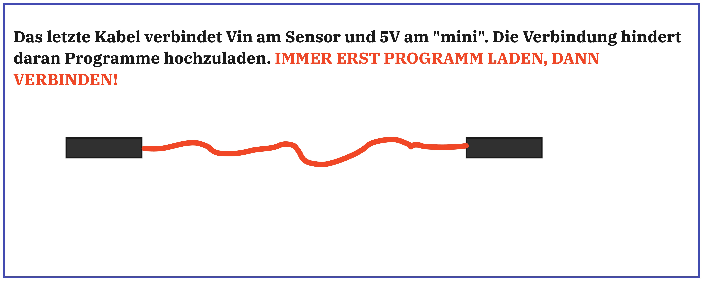

# Bauteile

# Aufbau

# Software

Bevor ein Programm auf den Mikrocontroller gespielt werden kann, bedarf es der Einrichtung einer Programmierumgebung. Hilfe dazu findet man hier:

https://github.com/technologiestiftung/werkstatt/blob/master/Mikrocontroller_einrichten/WemosD1Mini.md

## Code 

Dieses Programm schaltet eine LED an, wenn der Co2 Wert im Raum kritisch wird: 
https://github.com/Sarapedia/Train/blob/main/coco.ino 

Dieses Programm sendet die Co2 Werte über WiFi ins Internet:
https://github.com/Sarapedia/Train/blob/main/co2wifi.ino

