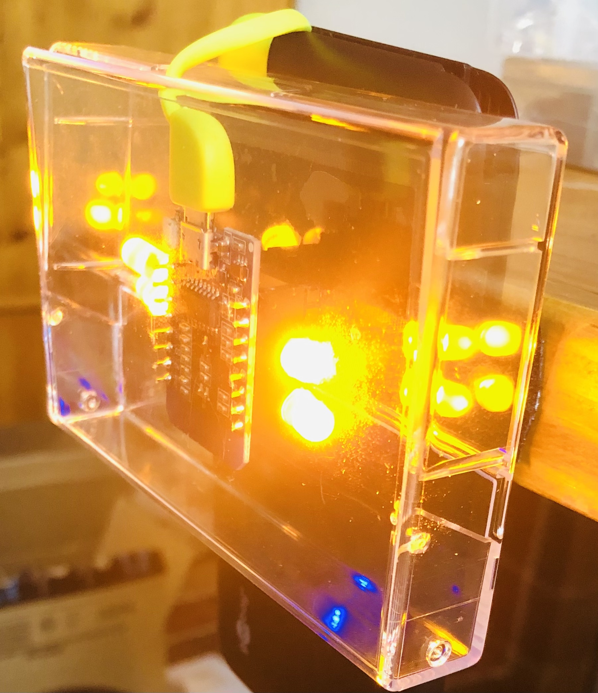
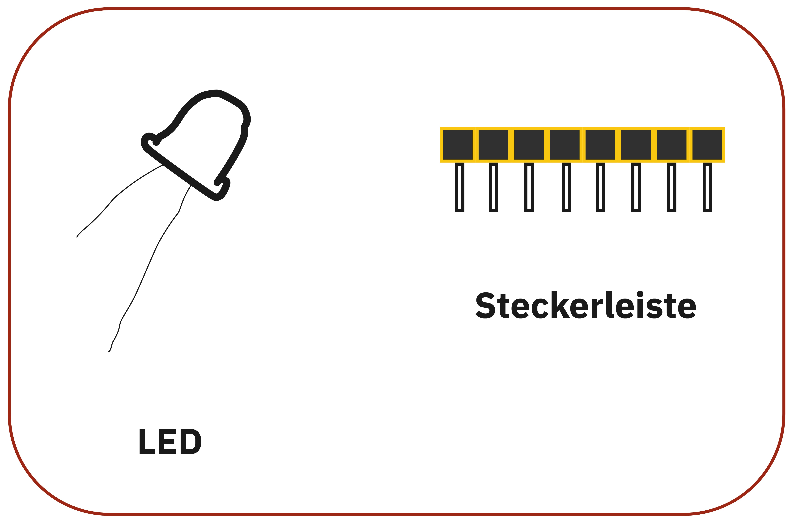
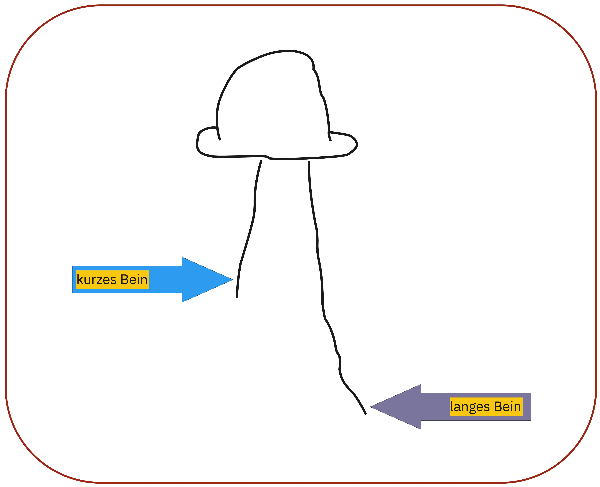
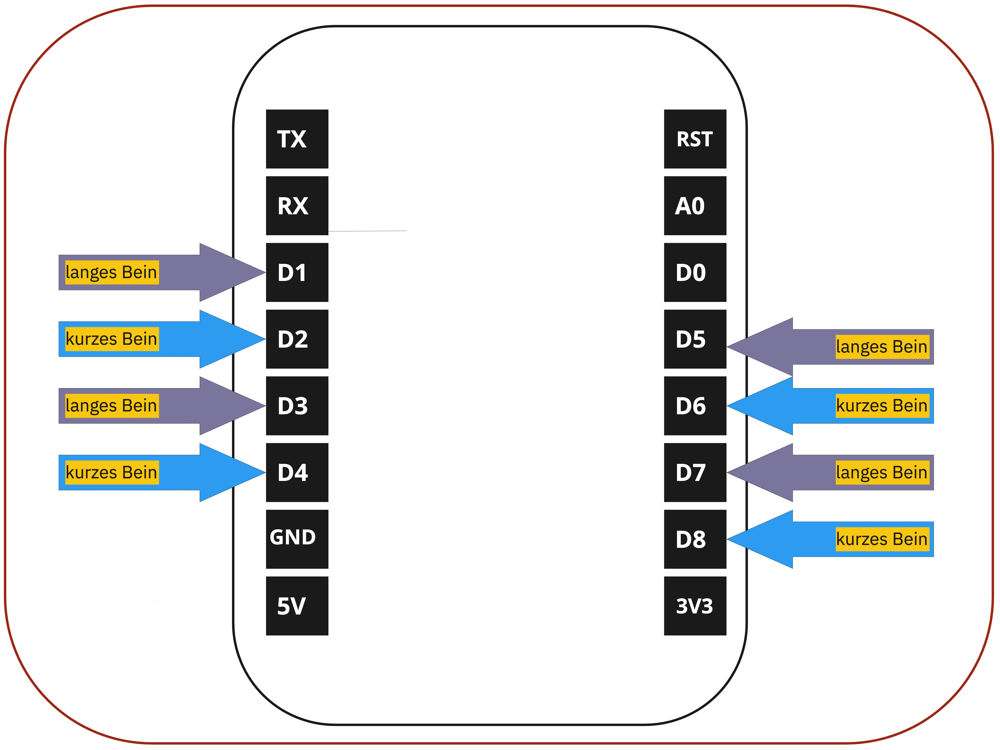

# Mobiles programmierbares Licht 

---

# Bauteile richtig platzieren

Wir benutzen einen Wemos mini D1 und handelsübliche LEDs.

# Programmierung

Das Program bike.ino https://github.com/technologiestiftung/werkstatt/blob/master/Fahrradlicht/bike.ino macht den Mikrocontroller zum einfachen Steckplatz für LEDs. Bike.ino könnte z.B so angepasst werden, dass die Lichter blinken oder auf Sensorinput reagieren.

Wie man den Microcontroller mit dem Computer verbindet, erklären wir hier: 
https://github.com/technologiestiftung/werkstatt/blob/master/Mikrocontroller_einrichten/WemosD1Mini.md

# Fernsteuern

Mit Blynk: https://blynk.io/ kann man sich einfach eine App zusammenbauen, mit der man den ESP8266 fernsteuern kann. Hier eine Schritt für Schrittanleitung. https://github.com/Teamon234/Code/issues/1#issue-1112419179
Noch besser ist Processing: https://processing.org/de/
Wie zeigt dieses Tutorial: https://www.uni-weimar.de/projekte/costumes-and-environment/2017/05/19/tutorial-connecting-adafruit-feather-huzzah-esp8266-wireless-in-real-time-to-processing-3-3computer/

