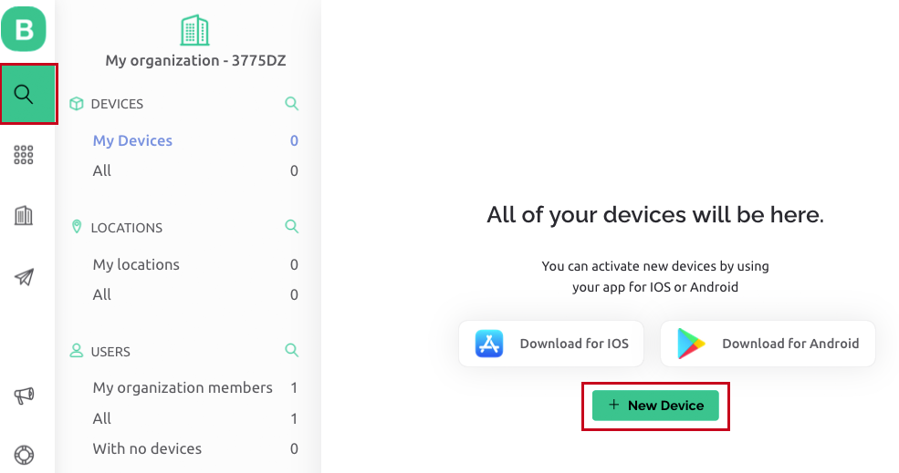
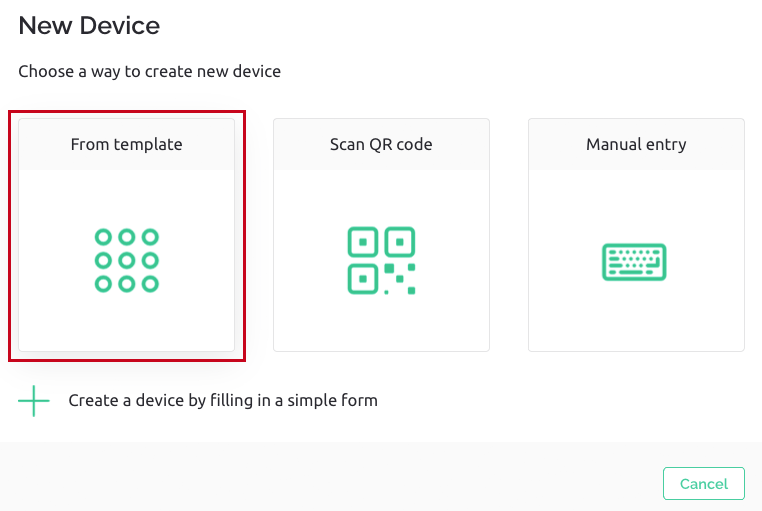
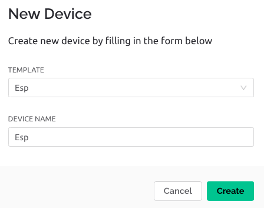
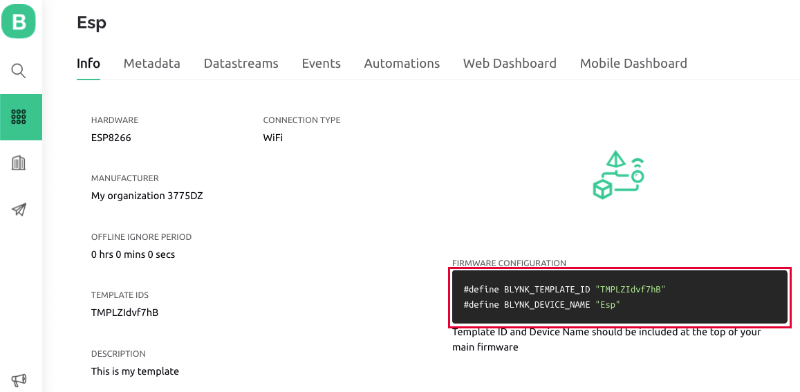
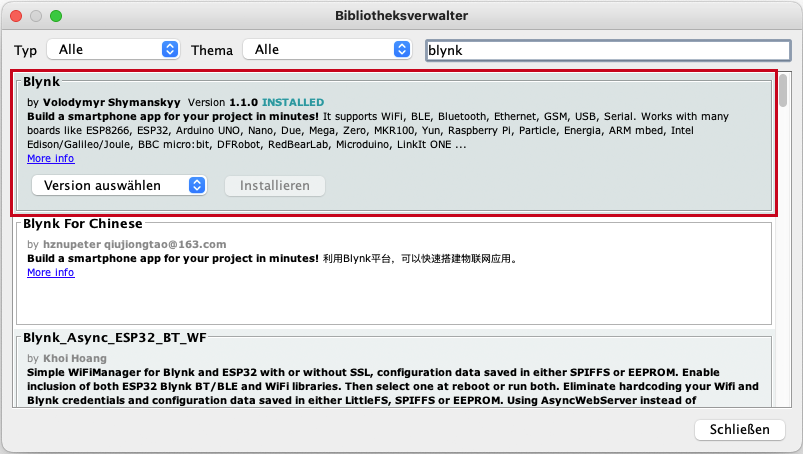
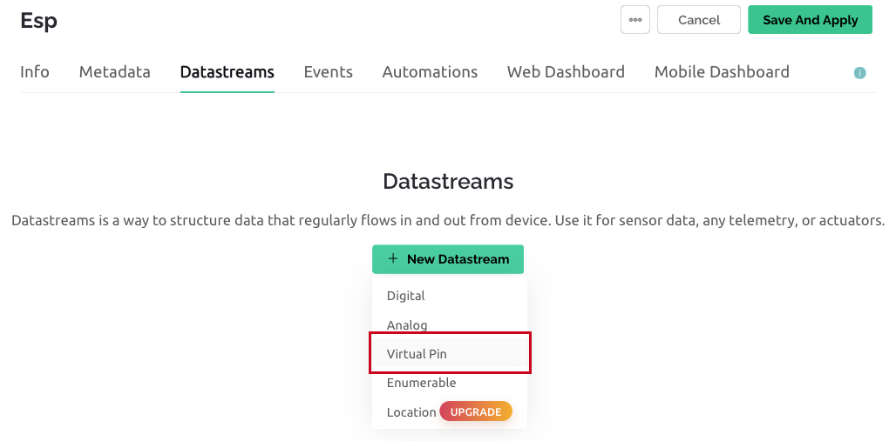
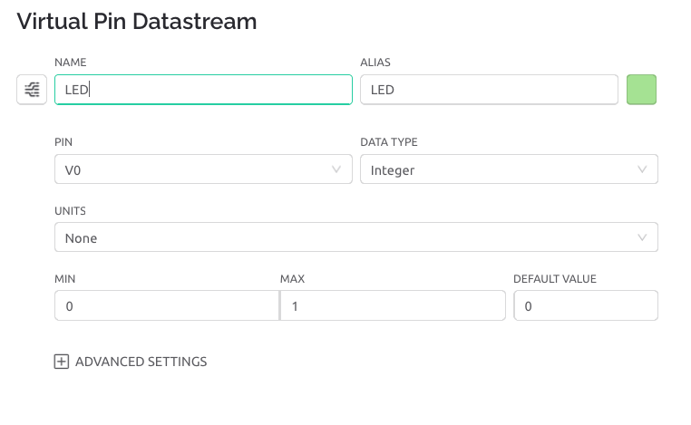

# Steuerung Wemos Mini über Blynk App

Wie du den Microcontroller mit deinem Computer verbindest, findest du hier: https://github.com/technologiestiftung/werkstatt/blob/master/Mikrocontroller_einrichten/WemosD1Mini.md

## Einrichten eines Templates in Blynk

Du kannst den Microcontroller über Wifi mithilfe der App Blynk steuern. Dafür erstellst du zu erst einen Account bei Blynk: https://blynk.cloud/dashboard/register

Wenn du eingeloggt bist, klicke im linken Menüband auf die Lupe. Erstelle nun ein neues Gerät über den Button "+ New Device", den du oben rechts findest. 

Wähle im nächsten Fenster die Option "From template" aus. Erstelle ein neues Template oder nutze ein bereits vorhandenes und vergib einen Namen.

-----

## Sketch

Für die Steuerung deiner Schaltung kannst du den folgenden Sketch in eine neue Arduino-Datei kopieren:
https://github.com/binaryupdates/Blynk-NodeMCU-ESP8266/blob/main/Blynk_NodeMCU_ESP8266/Blynk_NodeMCU_ESP8266.ino

Ergänze in Zeile 3 und 4 deine Template ID und deinen Device Name. Beides findest du in deinem Blynk-Account. Gehe dazu im linken Menüband auf den zweiten Menüpunkt mit den neun Punkten. Hier kommst du zu deinen vorher erstellten Templates. Wähle das eben erstellte Template aus. Unter dem Tab "Info" findest du die Code-Zeilen für die Template ID und der Device Name. Kopiere diese in Zeile 3 und 4 Deines Sketchs.

-----

## Blynk-Bibliothek laden

Lade die Bibliothek BlynkSimpleEsp8266.h in der Ardunio IDE über "Werkzeuge" >> "Bibliothek verwalten" 

Im Bibliotheksverwalter nach "Blynk" von Volodymyr Shymanskyy suchen.

Falls du noch nicht das Wemos Board und den USB-Port ausgewählt hast, mache es jetzt und lade den Sketch über den Button mit dem Pfeil nach rechts hoch.

-----

## Steuern Deines Boards über Blynk

Um dein Board mithilfe der Blynk-App zu steuern, gehe zurück in deinen Blynk-Account. Wir sind noch im Template-Menü deines erstellten Templates.

Erstelle im Tab "Data Stream" einen neuen Data Stream. Über den Button "+ Data Stream" öffnet sich ein Drop-Down-Menü in dem du "Virtual Pin" auswählst.

Vergib einen Namen und wähle den Pin "V0" aus. Dieser wird ebenfalls im Sketch verwendet. Falls du einen andern Pin wählst, muss diesen auch im Sketch ändern.

Anschließend gehst du auf den Tab "Web Dashboard" und erstellst dir einen Schalter, indem du den "Switch" aus der linken Spalte auf dein Dashboard ziehst. Den Schalter kannst du über das Zahnrad-Symbol bearbeiten, welches erscheint wenn du über den Schalter auf deinem Dashboard fährst. Gib dem Schalter einen Namen und wähle unter "Date Stream" den zuvor erstellten Data Stream aus. Du kannst dem Schalter noch eine Farbe zu ordnen und die Positionen des Schalter labeln.

Lade dir nun die Blynk-App auf dein Smartphone und melde dich mit deinem Account an. Erstelle dir unter "Device" eine Wifi-Verbindung zu deinem Microcontroller. Dafür benötigst du den Zugang zu deinem WLAN. Anschließend kannst du, wie eben im Tab "Web Dashboard" dir einen Schalter zur Steuerung der Schaltung über die Blnak-App erstellen.

