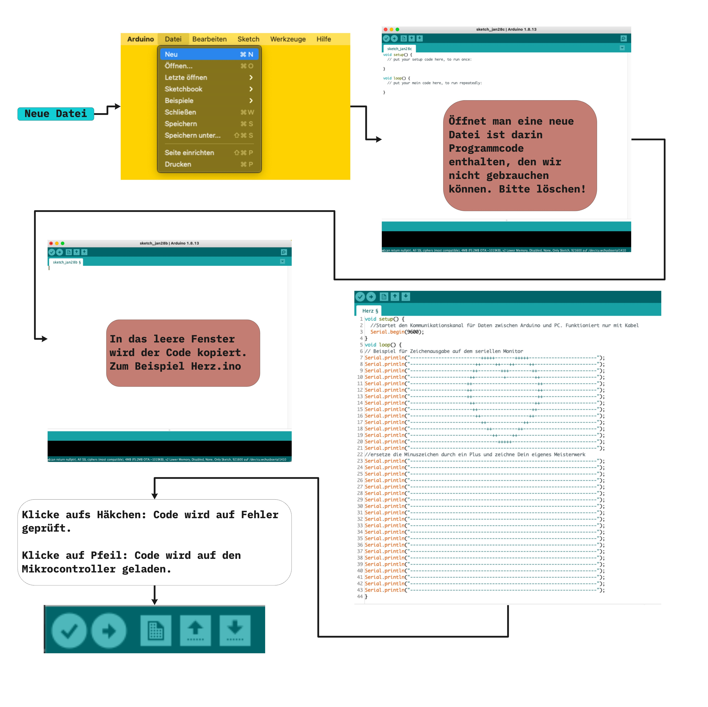

# Erste Schritte an der Hardware/Softwareschnittstelle

Bauteile: Mikrocontroller, der mit der Arduino IDE kompatibel ist. Hier z.B. Arduino Uno

1. Download Arduino IDE https://www.arduino.cc/en/software
2. Richte den Mikrocontroller ein. Hilfe: https://github.com/technologiestiftung/werkstatt/blob/master/Mikrocontroller_einrichten/Arduino.md 
3. Diesen Beispielcode wie im Bild unten hochladen  https://github.com/technologiestiftung/werkstatt/blob/master/HackingInnovationBias/Herz.ino

# Herz.ino gibt Herz auf dem seriellen Monitor aus

Öffne den Seriellen Monitor 

# Herzklopen.ino gibt Herz aus , wenn verbundener Ultraschallsensor in Abstand von 10cm ein Hindernis sieht
