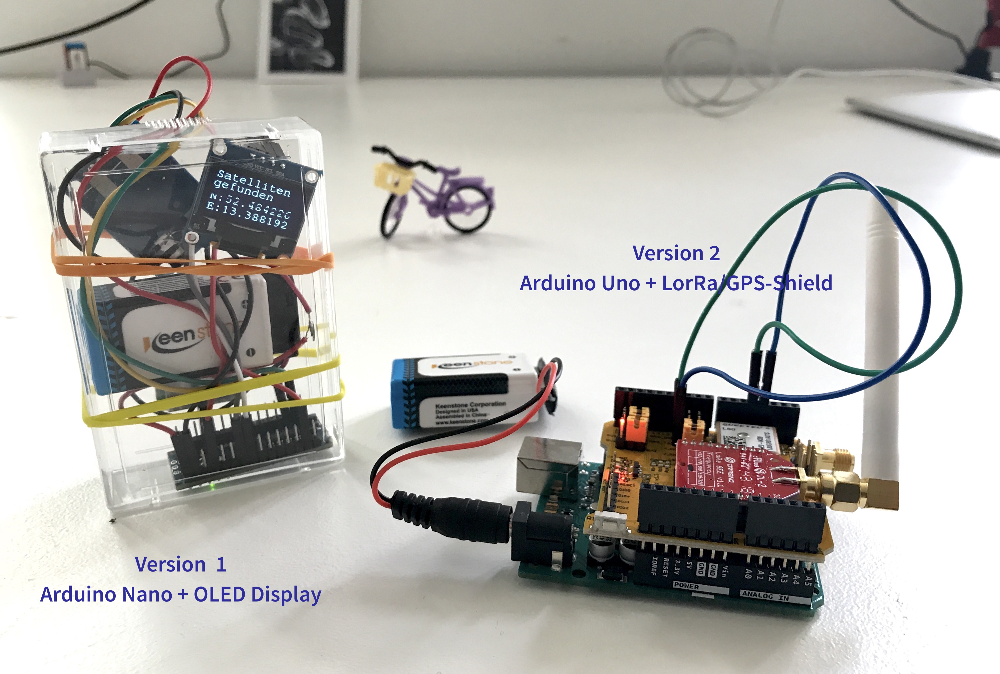
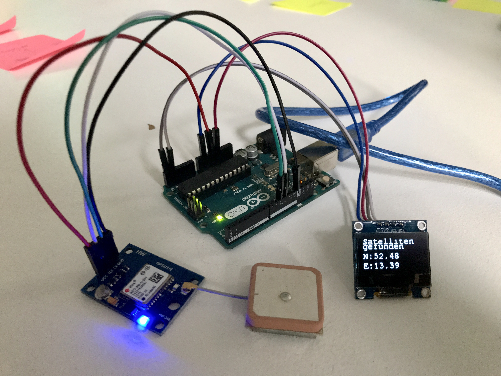
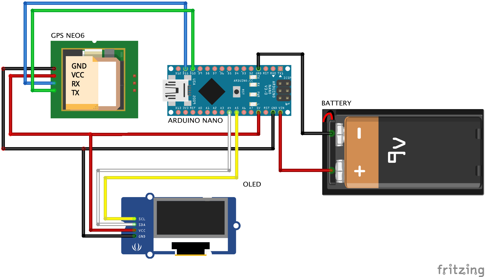
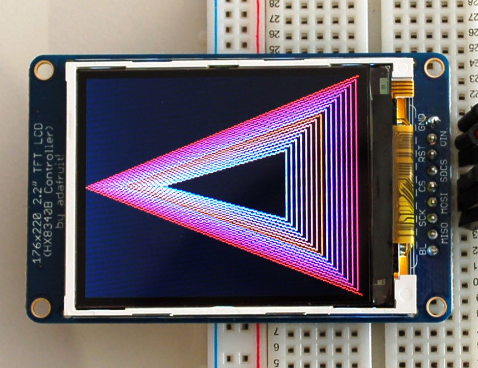
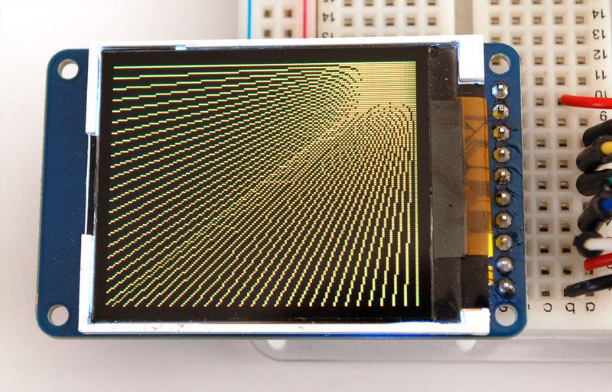
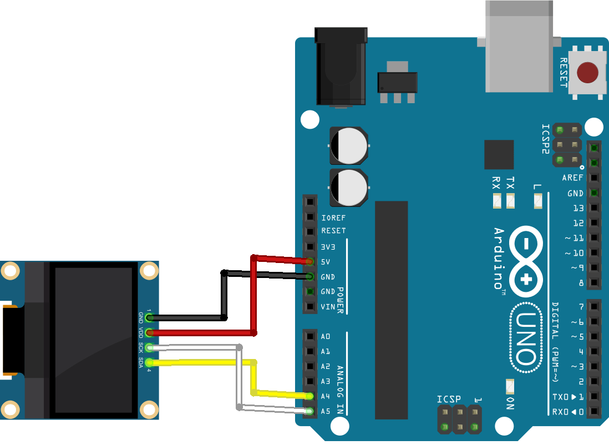
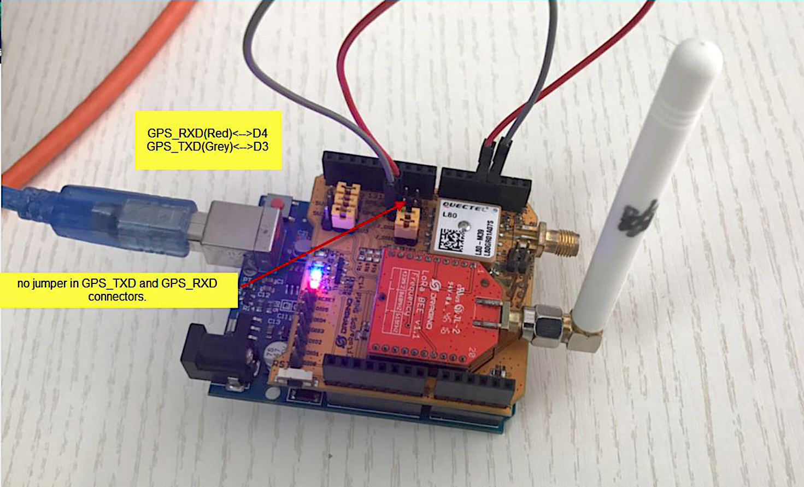

# Bauanleitung GPS-LoRa-Tracker
## Workshop vom 30. August 2019

Der Arduino Uno (https://store.arduino.cc/arduino-uno-rev3) ist ein Mini-Computer, der sich Dank der Arduino-Umgebung sehr leicht programmieren lässt. Es gibt verschiedene Ausführungen der Arduinos, wobei sich diese in den Anschlüssen, Pins, Baugröße, der Prozessorleistung uvm. unterscheiden. In dieser Bauanleitung haben wir den Arduino Uno bzw. den Arduino Nano mit Hilfe eines GPS-Moduls, eines LCD bzw. OLED-Displays und mit Hilfe eines LoRa-Shields ein wenig Leben eingehaucht. Dabei haben wir insgesamt zwei Versionen des GPS-Trackers gebaut:
* **Version 1:** Arduino Nano + NEO 6M GPS-Modul mit Antenne + 0.96" I2C OLED-Display (keine Übertragung ins LoRaWan)
* **Version 2:** Arduino Uno + aufgstecktes LoRa/GPS-Shield mit Xbee und GPS-Modul (Datenübertragung über LoRaWan möglich)

Nachfolgend soll das Setup von Version 1 beschrieben werden.

## Version 1: GPS-Tracker mit kleinem OLED-Display

#### Hardware
Welche Hardware man für diese Version benötigt:
* Arduino Nano à 20€
* NEO 6M GPS-Modul à 8€ 
* 0.96" I2C OLED-Display  à 5€ 
* ein paar Kabel à 3€ 
  &nbsp;
  &nbsp;
  &nbsp;
  &nbsp;

Der Gesamtpreis für die Hardware für GPS-Tracker Version 1 liegt damit bei **36 Euro**. Möchte man ein paar Euros sparen, kann man auch den Arduino Nano inkl. Mini-USB Kabel (benötigt man, um das Setch auf das Board zu übertragen) auch "nicht original" für nur 5 Euro bestellen ([HIER](https://www.az-delivery.de/products/nano-v3-0-pro?ls=de)). Funktioniert für uns genau so gut.

#### Verkabelung
Die einzelnen Hardware-Komponenten müssen wie folgt miteinander verkabelt werden. Für die Stromversorgung haben wir uns in unserem Schaltplan für eine 9V Batterie entschieden, das Board kann aber auch ohne Probleme mit dem Mini-USB-Kabel per Computer versorgt werden.

#### Libraries
Jedes einzelne Modul bzw. jede einzelne Hardware-Komponente, wie bspw. Display, GPS-Sensor etc., muss natürlich irgendwie über den Arduino angesteuert werden. Demnach benötogt man für bestimmte Module auch bestimmte Libraries, die in den Programmcode in den Präprozessor (also ganz am Anfang des Codes) durch das Schlüsselwort #include eingebunden werden müssen. Für diese Version haben wir 3 zusützliche Libraries eingebunden, die nicht per default über Arduino bereitgestellt werden. Das sind:
* https://github.com/adafruit/Adafruit-GFX-Library
* https://github.com/adafruit/Adafruit_SSD1306
* https://github.com/mikalhart/TinyGPSPlus (im Ordner src)

#### Code aka. Sketch
Nach dem Setup der Hardware, muss nun mit Hilfe der Arduino-IDE ein Sketch (Sketch == Code == Programm) auf das Arduino-Board geladen werden. Dazu schließt man den Arduino vie Mini-USB an seinen Client (Client == Rechner == Laptop) an und öffnet die Arduino IDE (Download der Arduino-IDE [auf der offiziellen Website](https://www.arduino.cc/en/main/software)). In der IDE (Integrated Development Environment aka. Integrierte Entwicklungsumgebung) schreibt man das Sketch für den Mikrocontroller und lädt es schließlich auf das Board.

**Wichtig**: damit das Sketch auf das Board geladen werden kann, muss zunächst das richtige Board (Arduino Nano) und der richtige Port (incoming USB-Port) ausgewählt werden. Ihr könnt beide Einstellungem im Menüband unter "Tools" überprüfen und anpassen.

**[Hier geht's zum Code](https://github.com/technologiestiftung/workshops/blob/master/codes_sketches/GPSTracker_LoRa_Nano_V1.ino)**

#### Weiterführende Links
Untder dem nachfolgendem Link, findet ihr eine ähnliche Bauanleitung mit gleichen Hardware-Komponenten. Der Autor hat in diesem Fall mit das Display sehr gut mit Hilfe der dtostrf-Funktion gestaltet: https://robotzero.one/arduino-neo-gps-oled/
Die dtostrf-Funktion erklärt: https://www.mikrocontroller.net/topic/86391

## First things first: das OLED-Display erklärt

Das OLED-Display wird über die Adafruit GFX Grpahics Library angesteuert und kann dadurch beliebig strukturiert und gestaltet werden. Dabei sind der Kreativität keine Grenzen gesetzt.

Ausführliches Erläuterungen zu den einzelen Funktionen der Library findet Ihr hier: [im offiziellen Library Guide](https://learn.adafruit.com/adafruit-gfx-graphics-library?view=all). Darin wird u.a. erklärt, wie man Schriftfarbe, -Größe, und -Anordnung definiert und wie die Funktionen und deren Parameterübergabe prinzipiell genutzt werden können. 

Möchte man eine Custom Font benutzen, kann man sich diese ebenso in den Präprozessor mit einer .h-Datei einbinden. Ein Auswahl der Custom-Fonts könnt Ihr euch [HIER](https://learn.adafruit.com/pages/6656/elements/2002817/download) herunterladen.
Für unseren GPS-Tracker haben wir kein Farbdisplay, sondern ein simples SW-Display genutzt.

Wer erst einmal nur mit dem Display warm werden möchte, der kann dieses auch einzeln an den Arduino anschließen. Eine asuwführliche Beschreibung wie das Display mit dem Arduino verkabelt werden muss, findet ihr hier: https://randomnerdtutorials.com/guide-for-oled-display-with-arduino/. Gut zu wissen: SCL (Serial Clock) transportiert das Taktsignal , während SDA (Serial Data) die Datenbits überträgt. Durch die Verwendung von einem I2C-Bus kann man das Display über nur (genau diesen) zwei Pins ansteuern.

## Version 2: GPS-Tracker mit LoRa-Funktion

#### Hardware
Welche Hardware man für diese version benötigt:
* Arduino Uno Rev3 à 20€
* Dragino LoRa/GPS-Shield mit LoRa Bee à 34€
* ein paar Kabel à 3€

Der Gesamtpreis für die Hardware für GPS-Tracker Version 1 liegt damit bei **57 Euro**. Zugegeben, das klingt jetzt erst mal nach viel Geld. Für einen einfach, frustrfreien Einstieg in die LoRaWan-Tehmatik ist das Shield von Dragino jedoch sehr gut geeignet. Es kombiniert GPS-Modul + Antenne (sandfarbener Würfel) und LoRa Bee + Antenne (weißer Stab) und wird einfach auf den Arduino Uno aufsgeteckt. Man kann das Shield natürlich auch für weniger Geld aus den Eizelteilen nachbauen oedr gar LoRa-Modul und GPS-Modul einzeln mit den Arduino verkabeln. Diese Vorgehensweise beleuchten wir allerdings nicht.

#### Verkabelung

Zur Verkabelung mit dem Arduino Uno benötigen wir lediglich zwei Kabel.  
**Wichtig**: die Jumper von RX (Receive) und TX (Transmitter) müssen entfernt werden, damit ein Signal übertragen werden kann.

&nbsp;
&nbsp;

#### Libraries
* https://github.com/mikalhart/TinyGPS/releases/tag/v13 
    * Anleitung hier: http://arduiniana.org/libraries/tinygps/
* https://github.com/matthijskooijman/arduino-lmic
    * Tipps hier: https://www.thethingsnetwork.org/forum/c/nodes/lmic

#### Code
Der initiale Code wurde im Zuge des Aufbau's der LoRaWan-Community durch die Technologiestiftung, respektive Christian Hammel, erstellt.
**[Hier geht's zum Code](https://github.com/technologiestiftung/workshops/blob/master/codes_sketches/GPSTracker_LoRa_Uno_V2.ino)**

Wir haben eine ausführliche Präsentation zum Aufbau dieses GPS-Trackers erstellt. Darin werden u.a. auch noch einmal die Grundlage zum TTN (The Thing Network) und der Verbindung mit dem LoRaWan erklärt.  

**[Hier geht's zur Präsi!](https://github.com/technologiestiftung/workshops/tree/master/xx_GPSTracker_Pr%C3%A4si)**
