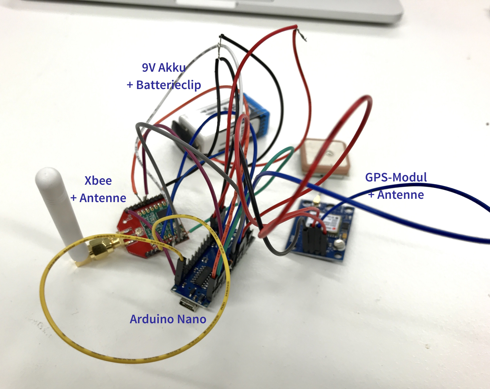
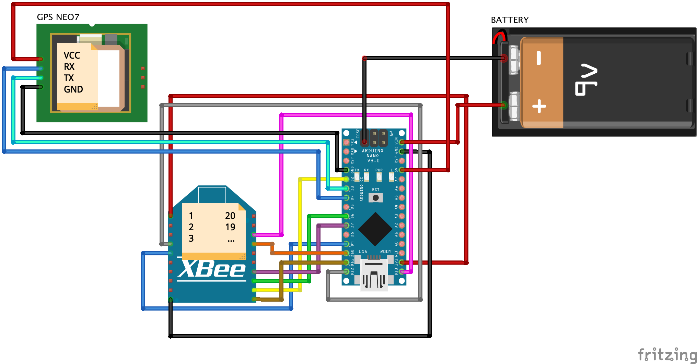
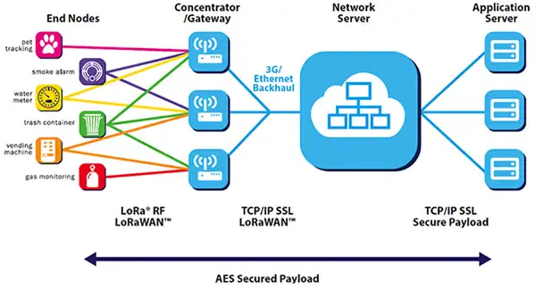
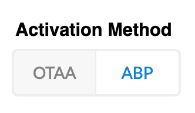
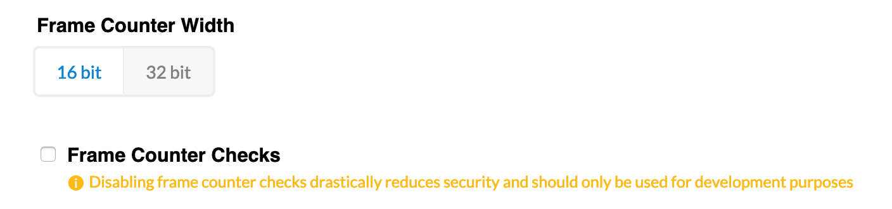

# Bauanleitung GPS-Tracker (optimized)
## Workshop vom 18. September 2019

Nach einem erfolgreichen ersten Workshop zum Thema LoRa und GPS haben wir uns kurzer Hand für einen weiterführenden, zweiten Workshop zum Thema entschieden. In diesem Workshop sollen die Vorzüge von beiden Versionen des ersten Workshops – sehr **kleines Packmaß mit Batteriestromversorgung (Version 1)** mit der **LoRa-Funktion (Version 2) kombiniert** werden. Dazu nutzen wir den bereits exitierenden Schaltplan von Version 1 (Nano mit kleinem Display), entfernen das Display und ersetzen es durch ein eine **Dragino LoRa Bee**. Die Verkabelung und der Code muss natürlich entsprechend angepasst werden – aber dazu später mehr.

#### Hardware 



Für die, nennen wir sie mal "Master-Version", benötigen wir die folgenden Hardware-Komponenten:
* 9V Batterien + Ladegerät 

* Battericlip

* GPS-Modul mit Antenne

* Arduino Nano 

* LoRa Bee

Zusammengerechnet kommen wir pro Tracker auf Kosten von 30€ und liegen damit weit unter dem Preis der gängigen GPS-Tracker (mit SIM-Karte), die i.d.R. bei 50€ anfangen.  

**Nice-To-Know:** der uns preiswerteste, bekannte GPS-Tracker (mit LoRaWAN) liegt bei 85€.

<!--  -->


#### Verkabelung

Die einzelnen Hardware-Komponenten müssen wie folgt miteinander verkabelt werden. Für die Stromversorgung haben wir uns in unserem Schaltplan für eine 9V Batterie entschieden, das Board kann aber auch ohne Probleme mit dem Mini-USB-Kabel per Computer versorgt werden.



Inspiration dazu haben wir auf [Björns Techblog](https://www.bjoerns-techblog.de/2017/07/mein-erster-lowcost-lorawan-node/) gefunden. Danke, Björn.


## First Things First: How To "Datenübertragung"

#### Via Mobilfunknetz und Internet
An dieser Stelle ein Hinweis: die konventionellen GPS-Tracker, wie man sie bei den einschlägigen Online-Händlern findet, nutzen das **Mobilfunknetz** und – ähnlich wie ein Handy – das Internet zur Daten- bzw. GPS-Koordinatenübertragung. Demnach ist für die Benutzung solcher Tracker eine eigene SIM-Karte für den Tracker unerlässlich. Vorteil hier, ist dass via Internet unter Nutzung von **Internetprotokollen wie TCP/IP und UDP** extrem Große Datenmengen (Stichwort: Breitband) mit extremer Geschwindigkeit übertragen werden können. Die Reichweite ist jedoch begrenzt. Durch die Kombination mit dem Mobilfunknetz (SIM-Karte) stellt die Reichweite zwar kein Problem mehr dar, jedoch verbrauchen diese Tracker sehr viel Leistung/Strom.  

#### Via LoRaWAN
Unser GPS-Tracker hingegen benutzt, wie der Name schon verrät, das **Low Range Wide Area Network**, welches zur Kategorie der Low-Range-Power-Netzprotokolle gehört, zur Übertragung der Daten. Also ein komplett anderes Netzprotokoll, welches speziell für die **drahtlose** Datenübertragung von **kleinen Datenmengen** (von 292 Bit/s bis 50 kbit/s), über **große Distanzen** (bis zu über 20km) zu verschiedensten, oft **batteriebetriebenen** Nodes, repektive Knotenpunkten, konzipiert wurde. Darüber hinaus weißt LoRa eine hohe Kapazität auf: bis zu **eine Million Knoten pro Anwendung** sind denkbar. Die LoRa-Technologie wird im sog. ISM-Band (Industrial, Scientific und Medical Frequenzbereich) bei 868 Megahertz in Europa und 915 MHz in Nordamerika betrieben. 

Viele **Internet of Things Anwendungen** (bspw. für Straßenbeleuchtung, Wetterstationen, etc.) und deren dazugehörigen Sensorknoten nutzen bereits seit der Erfindung im Jahr 2007 das LoRaWAN zur Datenübertragung. Die Nutzung ist kostenlos und kann sehr einfach über eine eigene, persönliche Applikation auf [**The Things Network**](https://www.thethingsnetwork.org/) verwaltet werden. Dazu aber später mehr.  

Der Aufbau des LoRaWAN ist recht simpel (siehe nachfolgendes Image). Wobei gilt:
* Endnode == unser GPS-Tracker
* Gateway(s) == können auf [https://ttnmapper.org/](https://ttnmapper.org/) gefunden werden
* Network-Server == Nutzung von The Thing Network
* Application Server == unsere Applikation auf dem Server von TTN.



Wer neugierig geworden ist und mehr über das LoRaWAN erfahren möchte, dem empfehlen wir die Website [https://www.lora-wan.de/](https://www.lora-wan.de/) zur weiteren Recherche. Aber nun, weiter im Text.


#### GPS-Tracker im TTN-Netzwerk registrieren
Was ist eigentlich dieses TTN? Ein kurzes Video schafft Klarheit:


Damit eine Verbindung zu unserer Endnode hergestellt werden kann, muss zunächst eine Apllikation im [The Things Network](https://www.thethingsnetwork.org/) eingerichtet werden. Folgende Schritte sind dazu notwenig:
* Profil auf TTN erstellen (Email-Adresse notwendig)
* über Console --> Applications --> Button "add application" neue, persönliche Applikation anlegen (application ID ist der Name)
* in der persönlichen Applikation über Devices --> Button "register device" den GPS-Tracker registrieren

Eine Anleitung mit Screenshots von der Benutzeroberfläche findet man auf [adafruit.com](https://learn.adafruit.com/the-things-network-for-feather?view=all).  

Sobald der GPS-Tracker registriert wurde, müssen noch einige **wichtige Einstellungen** getroffenen werden, da sonst die Datenübertragung 
im Zusammenspiel mit unserem Code nicht funktioniert:
* **Activation Method: ABP** (AppKey und NwkSKey können direkt in den Sketch geschrieben werden)
* **Frame Counter Width: 16 Bit** (wichtig, damit payload nicht überläuft)
* **Frame Coutner Checks: dekativieren** (bei erneutem Sketch-Upload oder Reboot werden Datenpackete mit bereits exitsierendem counter übertragen)






Sobald das Device einmal registriert ist, können die nötigen **drei Variablen, die im Sketch ergänzt werden müssen**, ausgelesen werden. Der Sketch befindet sich ebenfalls hier in diesem Repository im Ordner "sketches". Folgende Zeilen müssen angepasst werden:

```js
//*** Werte bekommt Ihr aus der TTN-Console, Format msb! ***
static u1_t NWKSKEY[16] = {
    0xB2, 0x5F, 0x35, 0x64, 0xB4, 0x89, 0xB8, 0x09, 0x08, 0x12, 0x7D, 0xAC, 0x0F, 0xC6, 0xF1, 0x5C
    }; 
    
static u1_t APPSKEY[16] = {
    0xB2, 0x5B, 0x16, 0x81, 0x53, 0x70, 0x49, 0xBF, 0x24, 0xBD, 0x55, 0xB2, 0xB5, 0xF6, 0xCB, 0x46
    }; 

// ACHTUNG: DEVICE ADRESSE MIT PRÄFIX 0x
// *** Wert bekomt Ihr aus der TTN-Console,Format hex-Style! ***
static const u4_t DEVADDR = 0X26011BF4
```

Ebenso sollte vor Upload des Sketches das Pinmapping der Dragino LoRa Bee überprüft werden. Gemäß unserem Schaltplan ergibt sich folgendes Pinmapping:

```js
const lmic_pinmap lmic_pins = {
    .nss = 10,
    .rxtx = LMIC_UNUSED_PIN,
    .rst = 9,
    .dio = {2, 6, 7},
    };
```

Das Pinmapping muss nur dann angepasst werden, wenn ihr von unserem Schaltplan abweicht.

**Last but not least** muss der Skethch nun noch auf den Arduino Nano übertragen werden. Dazu am besten vorher einmal auf **Verify** (Haken oben links in der IDE) klicken und den Code kompilieren. Wenn keine Fehlermeldung erscheint, dann kann der Sketch direkt mit klick auf **Upload** auf das Board geladen werden. Fertig!

**Hinweis:** Sollte eine Fehlermeldung beim Upload erscheinen, empfiehlt es sich die Einstellungen des Ports (hier: USB), des verwendeten Boards (hier: Arduino Nano) und des Prozessors (hier: ATmega328P ((Old Bootloader), weil kein original Arduino sondern, "nur" Clone) zu überprüfen.

Für Anregungen, Hinweise, Tipps & Tricks sind wir offen und dankbar. Ansonsten: happy coding! :)


