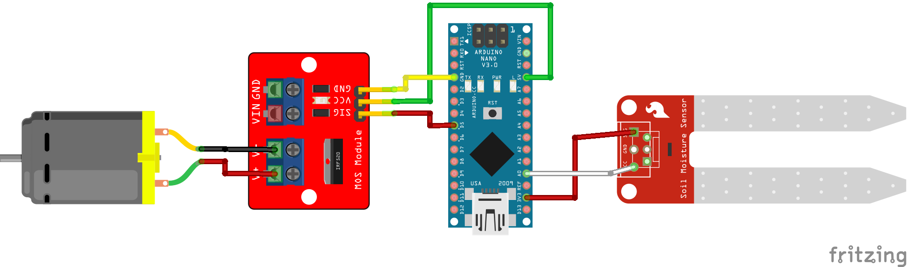

&nbsp;
# Bauanleitung Gardening Box
## Workshop vom 29. November 2019



#### Lorem ipsum
### Die Idee
Lorem Ipsum

### Hardware
* Arduino Nano
* Feuchtigkeitssensor
* Vollspektrum LED
* Pumpe
* Netzteil

Lorem ipsum

### First Things First: lorem ipsum
lorem ipsum

## Step 1 - Lorem ipsum
lorem ipsum

## Step 2 - lorem ipsum
lorem ipsum
```console
$ lorem ipsum
```


