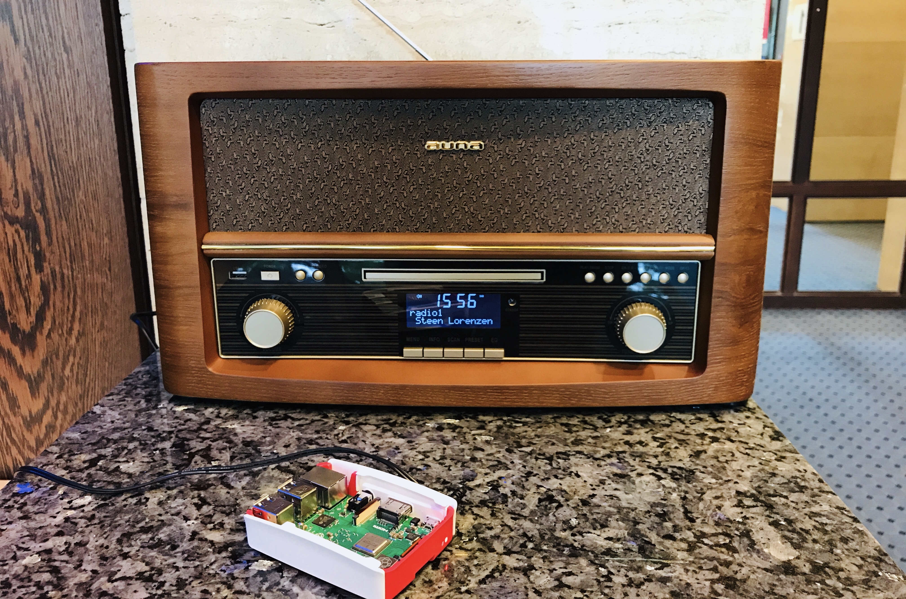

&nbsp;
# Bauanleitung Web Radio
## Remote Workshop zum zu Hause basteln



#### In dieser Bauanleitung wollen wir zeigen, wie man aus einem Bluetooth fähigen Radio und einem Raspberry Pi 3 ein Web Radio baut. Genauer: konfiguriert. Denn gebaut wurde das Radio ja schon.

### Die Idee
Man nehme ein Bluetooth fähiges Radio, verknüpftf dieses via Bluetooth mit dem RasPi, welcher wiederum mit dem lokalen WIFI verknüpft ist und alle möglichen Webradio-Sender dieser Welt abspielen kann. In Unserem Falle handelt es sich um ein **auna Belle Epoque 1906** mit Bluetooth-Funktion, USB-Anschluss und Fernebdienung. Was das Radio leider nicht hat: ein **WIFI-Adapter**. Die gute Nachricht: bei dem verwendetem Raspberry Modell Nummer 3 ist wurde ein boardinternes Chipset für WIFI und Bluetooth verbaut, sodass wir keine zusätzlichen Komponenten benötigen.

### Hardware
* (D)ein Client
* ein beliebiges Radio **mit Bluetooth-Funktion**
* Raspberry Pi 3 + SD-Karte + Netzteil (https://www.rasppishop.de/RPi3-A-Plus-Bundle)
* (wahlweise ein Arduino Uno WIFI (https://store.arduino.cc/arduino-uno-wifi-rev2))

In dieser Bauanleitung arbeiten wir mit dem Raspberry Pi 3. Wer lieber mit dem Arduino arbeitet und/oder ein paar Euro sparen möchte, der kann das Radio mit einem Arduino Uni WIFI (built-in WIFI) konfigurieren. Die Commands dafür werden hier allerdings nicht erläutert.


### First Things First: Headless-Betrieb & Secure Shell
Bevor es losgeht muss eine Entscheidung getroffen werden: möchte ich meinen RasPi headless oder "mit head" benutzen? Der Headless-Betrieb bedeutet, dass der Mikrocontroller ohnen Monitor, Maus und ohne Tastatur betrieben wird. Im Gegensatz dazu kann man an die USB bzw. HDMI-Anschlüssen des Mini-Rechners auch entsprechende Hardware anschließen. Aus Platz- und Kostengründen wird der RasPi jedoch oft headless betrieben.  

Möchte man auf einen headless RasPi zugreifen, muss dennoch eine Verbdinung hergestellt werden – und zwar mittels **Secure Shell** (kurz: SSH). Die Secure Shell ist ein Netzwerkprotokoll, mit dessen Hilfe man eine Netzwerkverbindung zwischen allen im Netzwerk befindlichen Geräten herstellen kann. In unserem Falle möchten wir eine Verbindung zwischen unserem Client (Client == Rechner == Laptop) und dem RasPi herstellen, um ihn mittels der Konsole des Clients steuern zu können.

## Step 1 - Betriebssystem auf dem Raspberry Pi 3 installieren
Wer seinen RasPi neu gekauft hat, muss zunächst erst einmal das Betriebssystem aufsetzen. Dazu kursieren bereits zahlreiche Anleitungen im Internet:
* Mit Montior, Tastatur & Maus: https://www.datenreise.de/raspberry-pi-inbetriebnahme-howto/
* Headless: **TBD**

## Step 2 - Raspberry Pi 3 via SSH mit dem Laptop verbinden
Um den RasPi mit dem Client zu verbinden, benötigt man zunächst die Netzwerkadresse des Mikrokontrollers.
**MAC Konsole** 
```console
$ arp -a | grep raspberry
```


