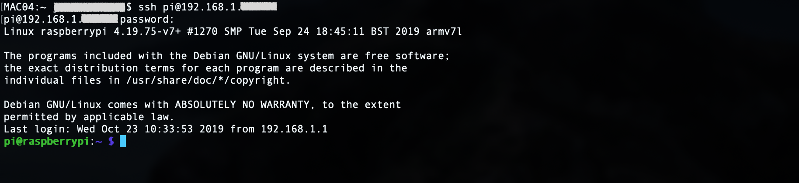
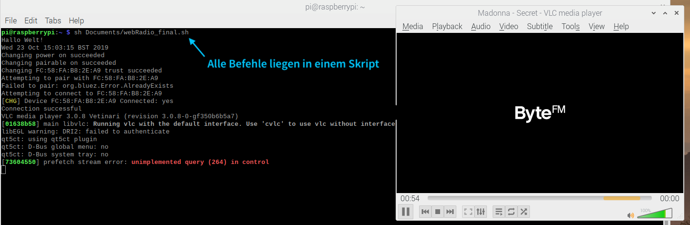

&nbsp;
# Wie man sein Bluetooth Radio zum Autoplay Web Radio hackt
## Remote Workshop für zu Hause


#### In dieser Bauanleitung wollen wir zeigen, wie man aus einem Bluetooth-fähigen Radio und einem Raspberry Pi 3 ein Autoplay Web Radio baut. Genauer: konfiguriert. 

### Die Idee
Man nehme ein Bluetooth-fähiges Radio, verknüpft dieses via Bluetooth mit einen RasPi, welcher wiederum mit dem lokalen WIFI verknüpft ist, und steuert über den Raspberry einen x-beliebigen Webradio-Sender an. In diesem Beispiel hier, haben wir die Konfigurationen in ein Shell-Skript geschrieben und dieses schließlich mit dem Autostart des Raspberrys gepackt. Und fertig ist der "autonome" RasPi.

### Hardware
* (d)ein Laptop/PC
* ein beliebiges Radio **mit Bluetooth-Funktion**
* Raspberry Pi 3 + SD-Karte + Netzteil (https://www.rasppishop.de/RPi3-A-Plus-Bundle)

In dieser Bauanleitung arbeiten wir mit dem Raspberry Pi 3. Der Vorteil im Vergleich zu den Vorgängermodellen: ab Modell Nummer 3 wurde ein boardinternes Chipset für die WIFI- und Bluetooth-Funktion verbaut, sodass wir keine zusätzlichen Komponenten benötigen. Wer lieber mit dem Arduino arbeitet und/oder ein paar Euro sparen möchte, der kann das Radio mit einem Arduino Uni WIFI (built-in WIFI) konfigurieren. Die Commands dafür werden hier allerdings nicht erläutert.

### First Things First: Headless-Betrieb mit Secure Shell
Bevor es losgeht muss eine Entscheidung getroffen werden: möchte ich meinen RasPi headless oder "mit head" benutzen? Der Headless-Betrieb bedeutet, dass der Mikrocontroller ohnen Monitor, Maus und ohne Tastatur betrieben wird. Im Gegensatz dazu kann man an die USB bzw. HDMI-Anschlüssen des Mini-Rechners auch entsprechende Hardware anschließen. Aus Platz- und Kostengründen wird der RasPi jedoch oft headless betrieben.

#### Wie & Warum SSH?
Möchte man auf einen headless RasPi zugreifen, muss dennoch eine Verbindung hergestellt werden – und zwar mittels **Secure Shell** (kurz: SSH). Die Secure Shell ist ein sicheres Netzwerkprotokoll, mit dessen Hilfe man eine Netzwerkverbindung zwischen jegliche im Netzwerk befindlichen Geräten herstellen kann. Die Authentifizierung innerhalb des SSH-Protokolls erfolgt unter der Nutzung von **kryptografischen Key Pairs** wordurch die Kommunikation zwischen zwei durch SSH verbundenen Geräte (Passwärter, Daten, etc) verschlüsselt übertragen werden. Jedem Netzwerktteilnehmer wird ein **Public Key** und ein **Private Key** zugeteilt, wobei letzterer streng geheimgehalten werden soll. Möchte man sich mit einem anderem Host (bspw. dem Raspberry) verbinden, benötigt man dessen **Host Key**.

In unserem Falle möchten wir eine Verbindung zwischen unserem Client (Client == PC == Laptop) und dem RasPi herstellen, um ihn mittels der Mac-Konsole ansteuern zu können. **SSH ist unsere einzige Verbindung zum Raspberry und ermöglicht. Mit Hilfe der Kommandozeile des Macs können wir Befehle über SSH an den RasPi senden.**

## Step 1 - Betriebssystem auf dem Raspberry Pi 3 installieren
Wer seinen RasPi neu gekauft hat, muss zunächst erst einmal das Betriebssystem aufsetzen. Dazu kursieren bereits zahlreiche Anleitungen im Internet. Wer mit Montior, Tastatur & Maus arbeitet, dem empfehlen wir diesen Beitrag: https://www.datenreise.de/raspberry-pi-inbetriebnahme-howto/

**Headless (für Mac) sieht der Ablauf wie folgt aus:**
* Micro-SD-Karte (mind. 8GB) mit Adapter in den Mac stecken und formatieren (wenn nicht gänzlich neu)
* Raspbian-Installationsdatei auf [www.raspberrypi.org](https://www.raspberrypi.org/) herunterladen
* die SD-Karte "flashen" (also in unserem Falle die Raspbian-Software in den ROM-Speicherbereich der SD-Karte schreiben)
  * folgender Kommand wird dazu benötigt, wobei die beiden Pfade individuell angepasst werden müssen
  ```
  sudo dd bs=1m if=/dein/pfad/zur/Installationsdatei.img of=/dev/deineDisk123
  ```
  * Kommand um die Bezeichnung der aktiven disks herauszufinden
  ```
  diskutil list
  ```
  * vor dem flashen der SD-Karte, muss man die entsprechende disk (respektive die SD-Karte) unmounten
  ```
  // Wenn "/dev/disk5: Resource busy", dann SDk-Karte unmounte
  sudo diskutil unmountDisk /dev/deineDisk123
  ```
Achtung: nach ausführen des Kommands wird die Disk geflasht -> es erscheint vorerst keine Ausgabe auf der Konsole, da dieser Vorgang    etwas Zeit in Anspruch nimmt. Mit der Tastenkombination Ctrl+T kann jedoch der Fortschritt abgefragt werden. Ist unser Mac mit dem flashen fertig, steckt man die Micro-SD-Karte in den RasPi, verbindet ihn via Netztteil mit Strom – und fertig.

## Step 2 - SSH für den Raspberry aktivieren (headless in der Boot-Partition)

Jetzt, da Raspbian auf unserer SD-Karte installiert wurde, können wir erste Einstellungen vornehmen. Die SD-Karte verbleibt dabei zunächst im Mac. Um unseren Raspberry per SSH mit unserem MAC verknüpfen zu können, müssen wir zunächst SSH auf dem Raspberry aktivieren, den SSH ist aus Sichheitsgründen (Stichwort: gleiche Benutzername und gleiches Passwort für alle Raspberries) standardmäßig deaktiviert. Zum aktivieren von SSH ohne Tastatur, Maus und Bildschirm kann man auf der SD-Speicherkarte in der Boot-Partition eine leere Datei mit dem Namen "ssh" (keine Datei-Endung!) erstellen. Wenn Raspbian später gestartet wird, dann wird SSH aktiviert und die Datei automatisch gelöscht.

## Step 3 - Raspberry in Betrieb nehmen

* Micro-SD-Karte in den Raspberry Pi stecken
* Raspberry mit Strom versorgen

**Hinweis rote LED:** Die rote LED zeigt den Status der Stromversorgung an. Wenn diese durchgehend leuchtet, liegt eine ausreichende Stromversorung von 5V vor. Sollte die rote LED anfangen zu blinken ist die Stromversorgung unter 4,63 Volt gefallen und es liegt ein Problem mit der Spannungsversorung vor.

**Hinweis grüne LED:** Die grüne LED zeigt den Status der SD-Karte an. Die LED leuchtet auf, wenn auf die SD-Karte zugegriffen wird (Lesen/Schreiben von Dateien). Sollte die grüne LED durchgängig leuchtenn, kann nicht auf die SD-Karte zugegriffen werden. Im schlimmsten falle bedeutet dieser Zustand, dass die SD-Karte lerr oder gar defekt ist.


## Step 4 - Raspberry Pi 3 via SSH mit dem Laptop verbinden
Den RasPi kann man auf zwei Wege mit dem Client verbinden: per **IP-Adresse** des Raspberry's im Netzwerk oder per **Hostnamen**. 

**Default-User: pi**
**Default-Host: raspberrybi
**Default-Passwort: raspberry**

**Via IP-Adresse:** Die Netzwerkadresse kann schnell und einfach über das Webinterface eures Routers ausgelesen werden. Wahlweise gibt es unzählige MAC-CLI-Befehle, unter anderem:

```
$ arp -a | grep raspberry
$ arp -a | grep raspi
```

Die einfachste **Variante (MIT Head)** ist es die IP-Adresse direkt in der Konsole des Raspberry's auszulesen
```
$ hostname -I
// wahlweise kann man auch nach der inet Adresse suchen
$ ifconfig
```

Der Username ist nach der ersten Inbetriebnahme standardmäßig gesetzt, sodass sich folgender Befehl ergibt: ssh *[username]*@*[IP-Adresse]*
```
$ ssh pi@192.168.x.xxx
```
Unter Usmständen gibt die Konsole folgenen Ausgabe zurück.

```
The authenticity of host '192.168.x.xxx (192.168.x.xxx)' can't be established.
ECDSA key fingerprint is SHA256:JH+C1P6D1lg6bOxSs7An56RIYHFAzIEnG4FN2pR8DWI.
Are you sure you want to continue connecting (yes/no)?
```
In unserem Falle ist das "genau richtig", denn es bestätigt, dass das kryptografische Verfahren von SSH prinzipiell funktioniert und wir uns zum aller ersten mal mit einem nicht authentifizierten Gerät (also dem RasPi) verbinden wollen und unser MAC den entsprechenden **Public Host Key** vom RasPi noch nicht authentifiziert hat. **ECDSA ist ein Algorithmus** der vom Host Key verwendet wird. Lange rede kurzer Sinn: wir bestätigen die Anfrage der Konsole mit "y + Enter", um den **Public Host Key** vom RasPi zu den **Known Host Keys** hinzuzufügen.

**Via Hostname:** Der Hostname ist ebenso wir der Username per default vom Raspberry vordefiniert und lautet rasberrypi. Möchte man sich via Hostnamen mit dem RasPI verbinden, ist folgender Befehl notwendig:
```
ssh pi@raspberrypi
```
Bevor es mit Step 5 weitergeht muss eine gültige SSH-erbingung zwischen Mac (Laptop) und RasPi  bestehen.



## Step 5 - RasPi mit dem Radio verbinden
Um sich mit dem Radio zu verbinden benötigt man zunächst die MAC-Adresse des Radios. Der Einfacheit halber kann man diese direkt über die Systemeinstellungen des MAC (Laptop) auslesen: Systemeinstellungen --> Bluetooth --> Geräte scannen --> Rechtsklick auf das Radio --> Adresse notieren. Die MAC-Adresse wir immer im *kanonischen Format* angegeben: 12-34-56-78-9A-BC

Für die erfolgreiche Verbdindung zum Radio sind mehrere Commands nötig. Wer einen "autonomen" Raspberry konfigurieren möchte, der sollte die nachfolgenden Befehle direkt in ein Skript-File .sh schreiben. Die Skript-Datei wird dann später im Autostart aufgerufen.

Zum Verbinden mit dem Radio sind folgenden Befehle notwendig:
```
$ bluetoothctl
Agent registered

$ [bluetooth]# power on
changing power on succeeded

$ [bluetooth]# default-agent
Default agent request successful

$ [bluetooth]# pairable on
changing pairable on succeeded

//wichtiger command, falls man sich erneut(!) mit dem gleichen Gerät verbinden möchte
$ [bluetooth]# remove 12:34:56:78:9A:BC
changing pairable on succeeded

$ [bluetooth]# scan on
Discovery started
// beim Scan sollte die MAC-Adresse des Radios erscheinen
[CHG] Device 12:34:56:78:9A:BC 12-34-56-78-9A-BC

//damit man nicht unnötig weiterscannt
$ [bluetooth]# scan off
Discovery stopped

//mit dem WebRadio pairen (!= verbinden)
$ [bluetooth]# pair 12:34:56:78:9A:BC
Attempting to pair with 12:34:56:78:9A:BC
[CHG] Device 12:34:56:78:9A:BC Connected: yes
[CHG] Device 12:34:56:78:9A:BC ServicesResolved: yes
[CHG] Device 12:34:56:78:9A:BC Paired: yes
Pairing successful

//überprüfen ob das Pairing wirklich geklappt hat; Radio sollte gelistet werden
$ [bluetooth]# devices
Device 12:34:56:78:9A:BC MeinRadioName

//automatisch mit dem Gerät (Radio) verbinden, wenn es eingeschaltet wird
$ [bluetooth]# trust 12:34:56:78:9A:BC
[CHG] Device 12:34:56:78:9A:BC Trusted: yes
Changing 12:34:56:78:9A:BC trust succeeded

//Finally: mit dem Radio verbinden
$ [bluetooth]# connect 12:34:56:78:9A:BC
```

Wer bis hierhin gekommen ist, hat es fast geschafft!

## Step 6 - Finally: WebRadio abspielen

Der letzte Schritt ist der wohl simpelste. 
Mit dem Command
```
vlc meinePlaylist.m3u
```
öffnet der bereits vorinstalliert VLC-Player die Playlist "meinePlaylist". Alle darin befindlichen Dateien wie bspw. mp3-Dateien oder weitere m3u-Dateien werden schließlich nacheinander abgespielt.

Fertig.

## Uns bekannte Stolpersteine & Troubleshooting
* Audio-Ausgang des Raspberrys steht nicht auf "Auto" (0), sondern auf "Analog" (1) oder "HDMI" (2)
```
sudo amixer cset numid=3 0
```
* Raspberry ist nicht im gleichen Netzwerk (WLAN) wie der MAC
* eurer Radio ist ein Headset --> folgendes module für pulseaudio schafft Abhilfe
```
$ sudo install pulseaudio-module-bluetooth
// danach muss die Sound-Middleware, aka. Pulseaudio neu gestartet werden
$ pulseaudio -k
$ pulseaudio --start
```
* Bluetooth connection funktioniert trotzdem nicht? Vielleicht hilft:
```
$ sudo service bluetooth restart
```
* Bluetooth Status abfragen
```
$ systemctl status bluetooth
```

## Der "autonome" Raspberry
### Ab hier geht's um die Autostart-Konfiguration



### Skript in den Autostart einbinden
Um ein Programm in den Autostart des Raspberry's einzubinden gibt es verschiedene Möglichkeiten. Ein gute Übersicht dazu liefert der Beitrag auf [rasberry.tips](http://raspberry.tips/raspberrypi-einsteiger/raspberry-pi-autostart-von-skripten-und-programmen-einrichten). 

In unserem How To wollen wir eine **.dektop-Datei** erstellen, um unser Skript mit dem Autostart auszuführen. Dazu erstellen wir also zunächst eine .desktop-Datei im richtigen Verzeichnis des Raspberrys mit dem folgenden Command:
```
$ sudo geany /etc/xdg/autostart/NameDerDatei.desktop&
```
Nice to Know: durch das kaufmännische "Und" am Ende des Befehls, könnt ihr das Terminal weiterhin bedienen, obwohl der Texteditor geöffnet ist. Die .desktop-Dateien haben einen schematische Struktur, auf die an dieser Stelle nicht weiter eingegangen werden sollen. Schließlich schreibt ihr die folgenden Zeilen in die Datei und speichert diese ab.
```
[Desktop Entry]
Type=Application
Name=irgendeinName
Terminal=false
Exec=sh /usr/bin/meinSkript.sh
```
Nach dem Attribut "Exec=..." wird der beim Autostart auszuführende Befehl angegeben. Da wir für die Verbindung via Bluetooth und das Abspielen des WebRadio-Senders mehrere Befehle benötigen, verlinken wir an dieser Stelle also zu einem Shell Skript "meinSkript.sh".


### Skript erstellen
Navigiert zunächst zum Verzeichnis aus der .desktop-Datei (*cd /usr/bin*). Dort angekommen erstellen wir nun das Skript, welches wir beim Autostart ausführen wollen. **Wichtig ist, dass der Pfad & Name des Skripts mit dem Namen in der .desktope-Datei übereinstimmen.** Die Datei-Endung .sh, denn somit wir der Code als Shell Script interpretiert. Im Skript stehen schließlich folgenden Anweisungen:
```
# !/bin/sh

#gibt dem Raspberry Zeit hochzufahren und Treiber zu laden
sleep 15s

#ab hier folgen die Befehle für Bluetooth-Systemsteuerung
sudo service bluetooth restart
sleep 1s
bluetoothctl agent on
bluetoothctl power on
bluetoothctl pairable on


bluetoothctl trust 12:34:56:78:9A:BC
bluetoothctl pair 12:34:56:78:9A:BC
sleep 1s
bluetoothctl connect 12:34:56:78:9A:BC

#warten bis mit bluetooth Device connected
sleep 4s

# wahlweise ein Speaker Test bevor die Playlist ausgegeben wird
# initialize a speaker test with 2 channels for 4 periods
# speaker-test -c2 -l4 -twav

bluetoothctl quit

vlc ~/Documents/meinePlaylist.m3u

exit 0
```

Speichern und fertig.
