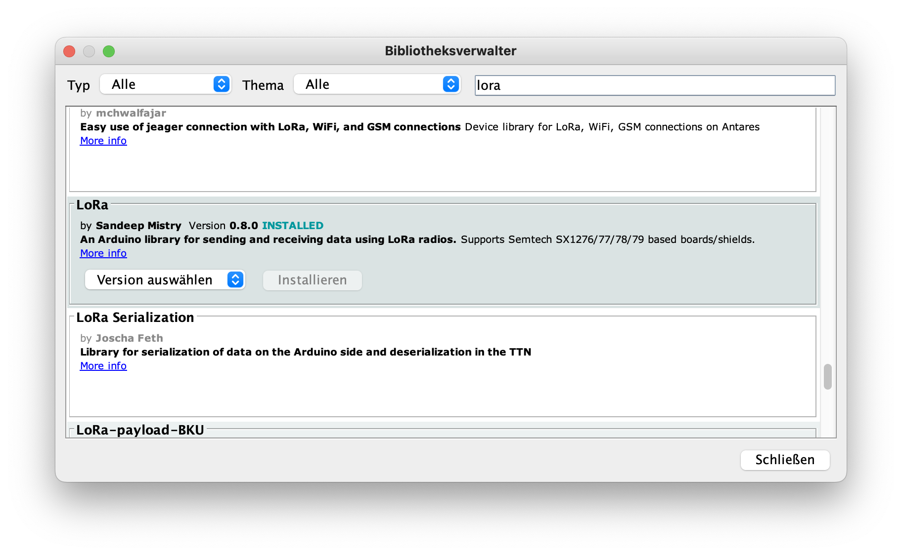

# LoRa-Transceiver
## Senden und Empfangen von Daten mit dem Lora-Bee

Anleitung basierend auf Random Nerd Tutorials: https://randomnerdtutorials.com/esp32-lora-rfm95-transceiver-arduino-ide/

-----

## Einrichten des ESP32

Wie Du den Microcontroller einrichtest, findest Du hier: https://github.com/technologiestiftung/werkstatt/blob/master/Mikrocontroller_einrichten/ESP32.md

Lade die Library für das LoRa-Modul herunter. Gehe dafür über "Sketch" >> "Bibliothek einbinden" >> "Bibliotheken verwalten..."
Suche in der Suchleiste nach der Bibliothek "lora" und installiere sie.

-----

## Verbinden des ESP32 mit dem LoRa-Modul

Verbinde mithilfe der Jumper-Kabel die Pins des ESP32 mit denen des LoRa-Moduls.

GND: GND
3.3V: 3.3V
DIO0: GPIO 2
RESET: GPIO 14
NSS: GPIO 5
SCK: GPIO 18
MOSI: GPIO 23
MISO: GPIO 19

Eine Übersicht der Verkabelung findest Du hier: https://randomnerdtutorials.com/esp32-lora-rfm95-transceiver-arduino-ide/

-----

## Senden von Daten über den LoRa-Bee

Das LoRa-Modul kann sowohl zum Senden als auch zum Empfangen von Daten genutzt werden. Den Sketch für das Senden von Daten findest Du hier unter der Überschrift "The LoRa Sender Sketch":

https://randomnerdtutorials.com/esp32-lora-rfm95-transceiver-arduino-ide/

Führe den Sketch aus und lasse dir die Ausgabe im Seriellen Monitor anzeigen. Vergiss nicht vorher den richtigen Port über "Werkzeuge" >> "Port" einzustellen.

-----

## Empfangen von Daten über den LoRa-Bee

Das LoRa-Modul kann dem Senden von Daten auch Daten empfangen. Den Sketch für das Empfangen von Daten findest Du wieder auf der Website unter der Überschrift "The LoRa Receiver Sketch":

https://randomnerdtutorials.com/esp32-lora-rfm95-transceiver-arduino-ide/

Wechsele dich bei der Ausführung des Sketchs mit einer Person im Raum aus. Eine/Einer sendet Daten, die/der andere empfängt die Daten. Ihr könnt euch kleine Nachrichten schicken, die anschließend im Seriellen Monitpr ausgegeben werden.

-----

## Senden und Empfangen von Temperaturwerten

Wir können nicht nur Textzeilen mit dem LoRa-Modul übermitteln. Es lassen sich auch andere Werte und Daten mit dem Modul senden. Im nächsten Schritt wollen wir den Tenperatursensor DHT-22 in die Schaltung einbinden und die Temperaturwerte übermitteln.

Verbinde den Temperatursensor wie folgt mit deiner Schaltung.

Um die Temperaturwerte übermitteln zu können, haben wir uns von dem Sketch auf der folgenden Website inspirieren lassen und die Caode-Zeilen für den Tempertursensor DHT-22 in unserem LoRa-Sender-Sketch ergänzt. Hier geht es zum Tempertursensor-Sketch: https://funduino.de/anleitung-dht11-dht22

Kannst du den LoRa-Sender-Sketch um die Abfrage der Tempertur ergänzen?

Du findest den fertigen Sketch auch hier: https://github.com/technologiestiftung/werkstatt/blob/master/LoRa/LoRa_Temp.ino

