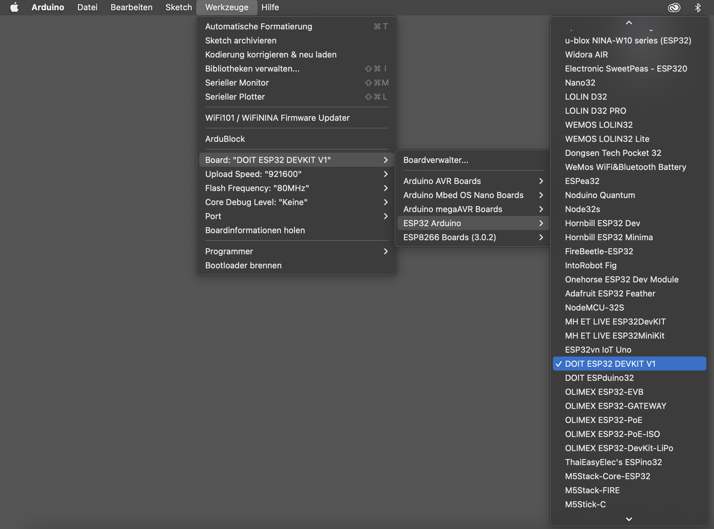

# ESP32 einrichten

## Voreinstellungen (Preferences)
Voreinstellungen (Preferences) öffnen. Je nach Arduino-Version und Betriebssystem kann der Weg dort hin varrieren.

unter iOS: "Arduino" >> "Preferences..."
unter Windows: "Datei" >> "Einstellungen"
  

Unter "Zusätzliche Boardverwalter URLs" folgende URL ergänzen: https://dl.espressif.com/dl/package_esp32_index.json
  

-----

## Boardmanager 

Den Boardverwalter über "Werkzeuge" >> "Board" >> "Boardverwalter..." öffnen.
In der Sucheleiste nach esp32 suchen und anschließend das Board installieren.

-----

## Board auswählen

Zum Schluss das Board unter "Werkzeuge" >> "Board" >> "ESP32 Arduino" >> "ESP32 DEV Module" auswählen.

-----
