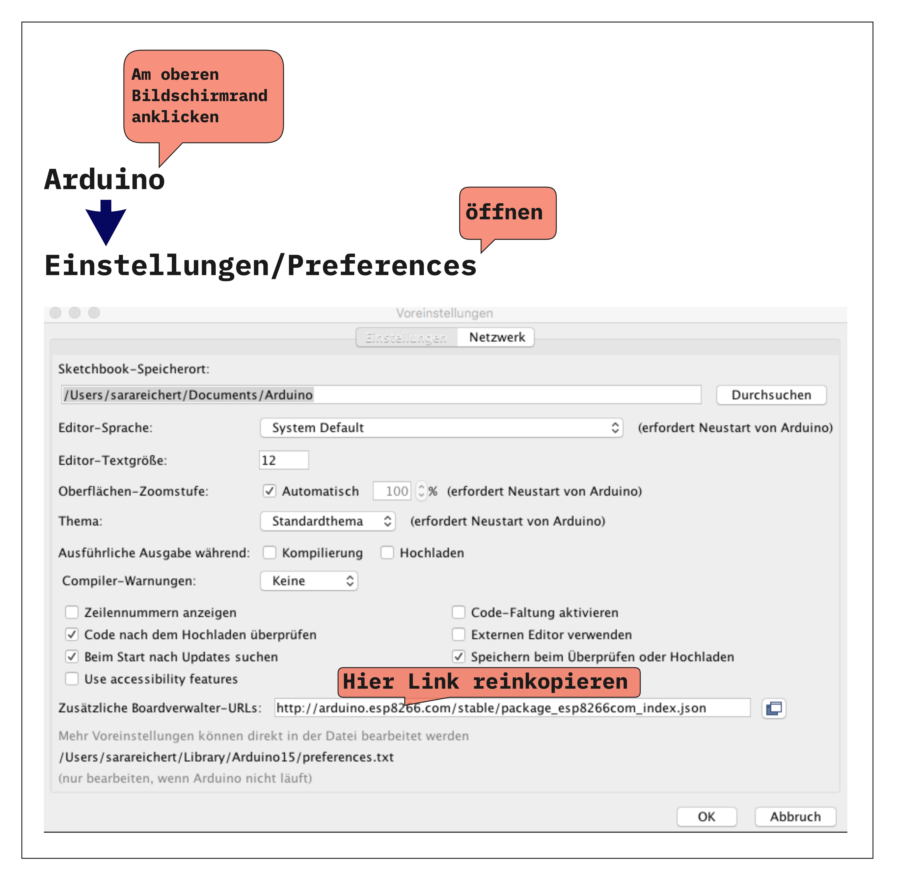
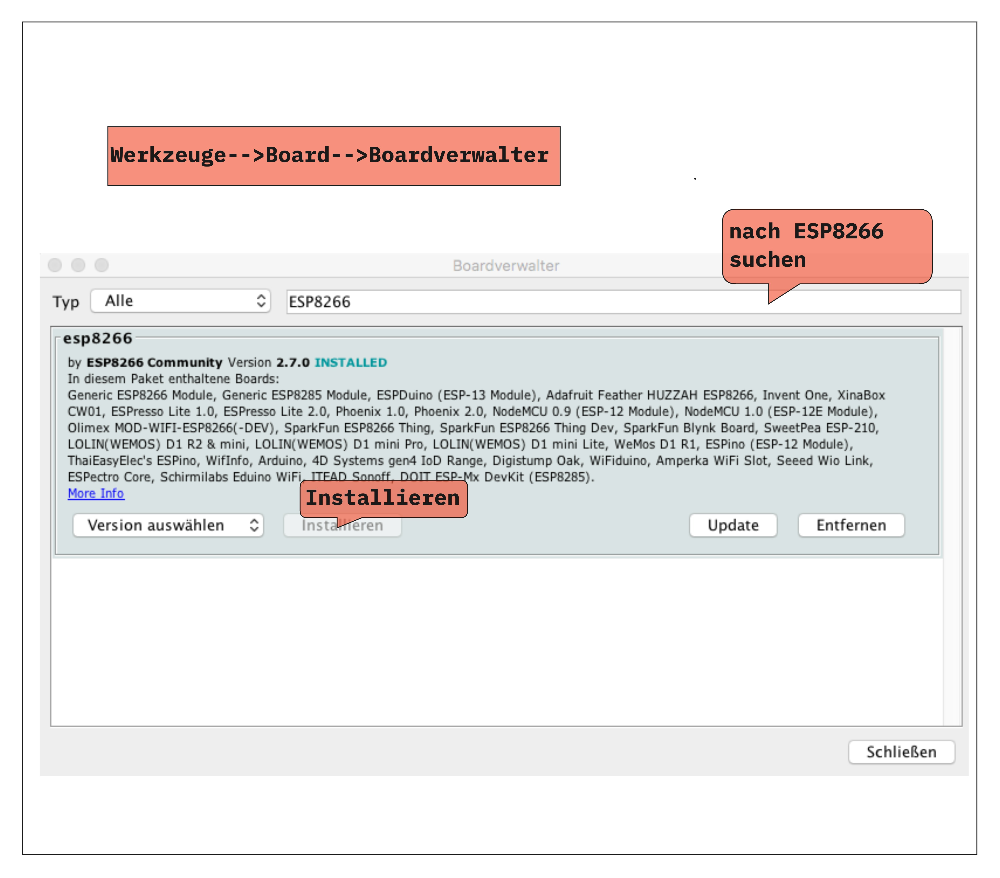
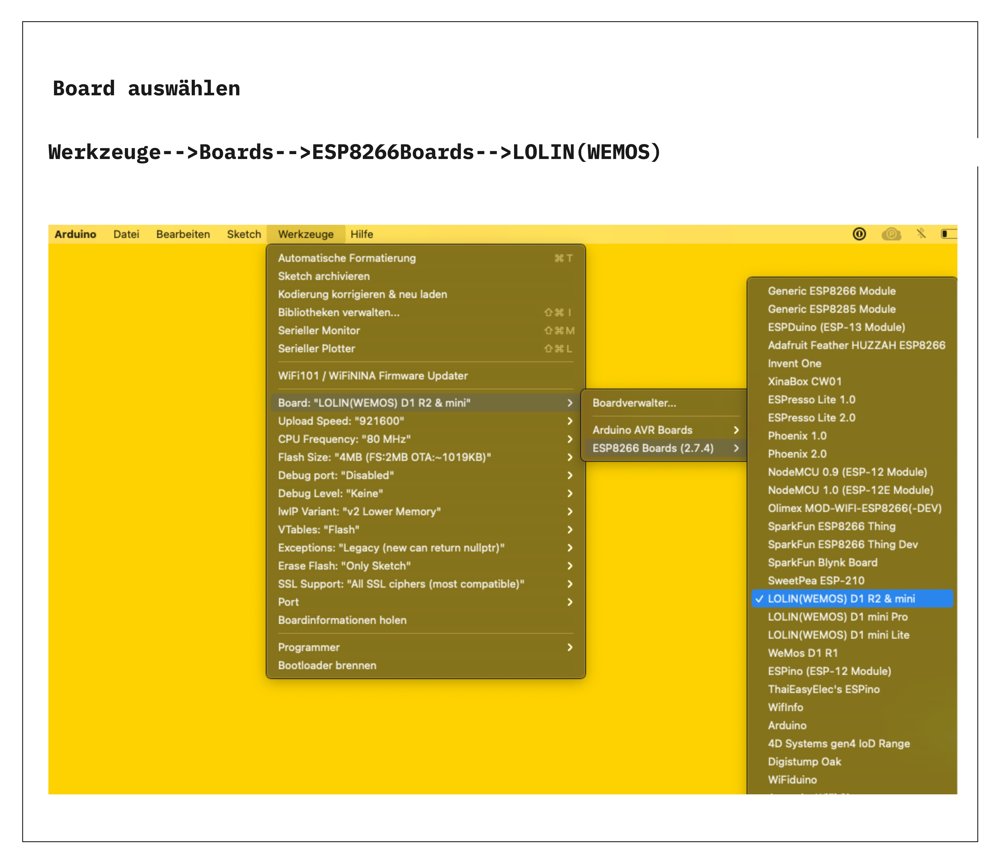

# Wemos D1 Mini mit dem Computer verbinden

## Voreinstellungen (Preferences)

Am oberen Bildschirmrand den Reiter öffnen, der zu den Voreinstellungen(Preferences) führt. Je nach Arduinoversion variiert der Weg möglicherweise etwas.
Diesen Link wie im Bild unten gezeigt einfügen. http://arduino.esp8266.com/stable/package_esp8266com_index.json

-----

## Boardmanager 

Am oberen Bildschirmrand nach dem Boardmanager suchen und ESP8266 installieren

-----

## Board auswählen

-----

## Treibertest

1. Mikrocontroller mit PC verkabeln
2. Am oberen Bildschirmrand den Reiter "Werkzeuge" --> "Port" öffnen
3. Verändern sich die Einträge in der angezeigten Portliste, wenn man das Kabel rauszieht?

Ja: Gratulation der Treiber ist schon vorinstalliert
Nein: Treiberinstallation

