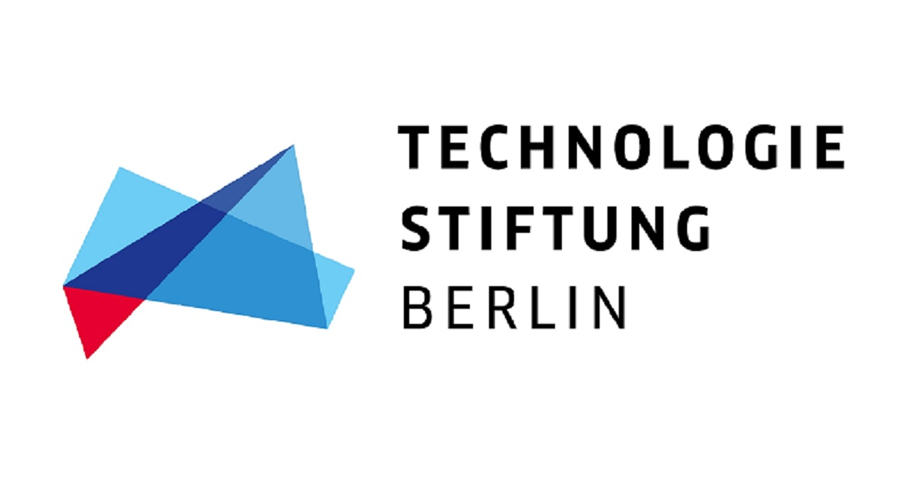
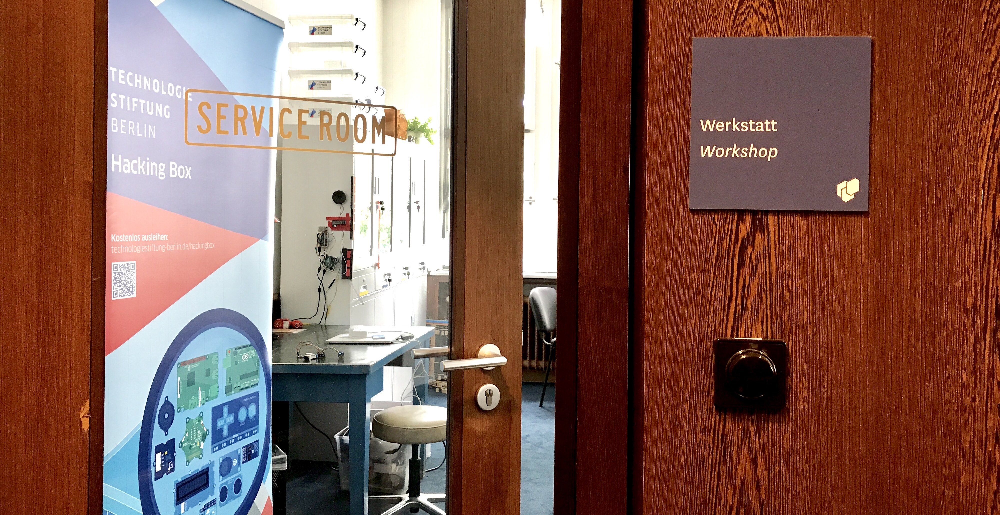

&nbsp;
# Offene Werkstatt im CityLAB Berlin
Die **Technologiestiftung** veranstaltet regelmäßige Workshops im **CityLAB Berlin** im ehemaligen Offizierskasino des **Flughafen Tempelhof**. Die Termine für die sog. **Offene Werkstatt** stehen auf der [CityLAB-Website](https://www.citylab-berlin.org/)

### In diesem Repository findet ihr:
* HOW TO Anleitungen zu den einzelnen Workshops
* Programmcodes zu den Workshops
* Images zu den Workshops

In den **HOW TOs** findet ihr eine ausführliche Anleitun zu den jeweiligen Workshops mit entsprechenden Bildern und verlinkungen zu Codes, Libaries, Anleitungen und weiterführenden Input. 

&nbsp;

&nbsp;
## Übersicht aller vergangenen Workshops im CityLAB

#### Workshop am 18.09.2019 - GPS-Tracking & LoRaWAN mit dem Arduino TEIL 2/2
Geeignet für Neueinsteiger_innen und Teilnehmer_innen von TEIL 1. Bau von einer Version, die die Vorzüge von den beiden Versionen aus Workshop TEIL 1 verbindet: GPS-Tracker auf Arduino Nano mit LoRaWan-Funktion (kleines Packmaß, Display zur Kontrolle möglich).

#### Workshop vom 30.08.2019 – GPS-Tracking & LoRaWAN mit dem Arduino TEIL 1/2
Geeignet für Neueinsteiger_innen in das Thema Arduino, GPS-Tracking, serielle Kommunikation & LoRaWAN. Bau von zwei Versionen: GPS-Tracker auf Ardduino Nano mit OLED-Display (kleines Packmaß, kein LoRaWan) // GPS-Tracker auf Arduino Uno mit LoRaWan-Funktion (großes Packmaß, ohne Display)

&nbsp;
## Remote Workshops
Einige **kleinere Projekte** und Testfälle haben wir ebenfalls dokumentiert, sodass Ihr sie nachbauen und selbst coden könnt. 
Beispiele hierführ sind bspw. die Übertragung von Temperaturmesswerten ins TTN (The Things Network) und das testen der seriellen Kommunikation (zwischen Lappi und Arduino Baord). Unter den **HOW TOs** findet ihr ausführlich **kommentierte Codes.**

