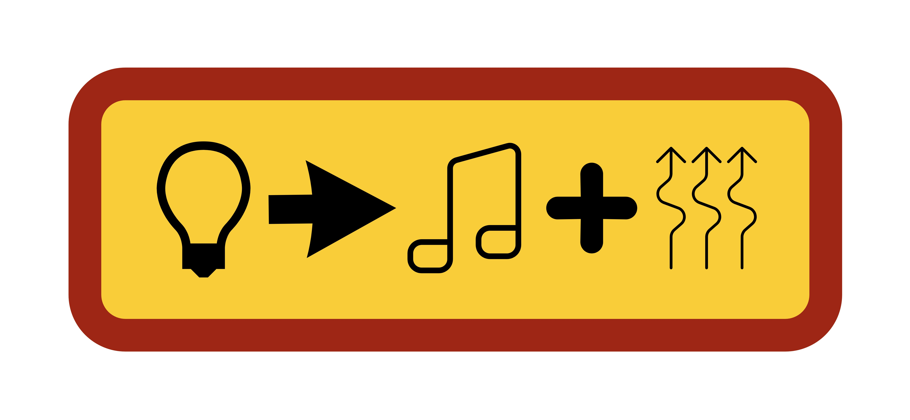
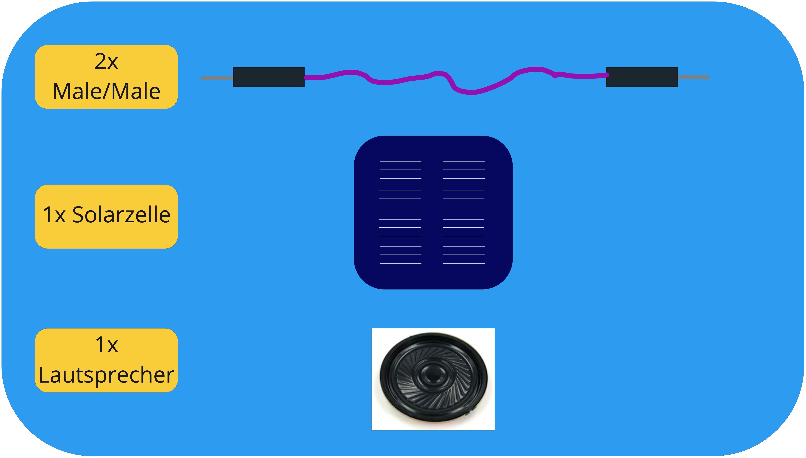
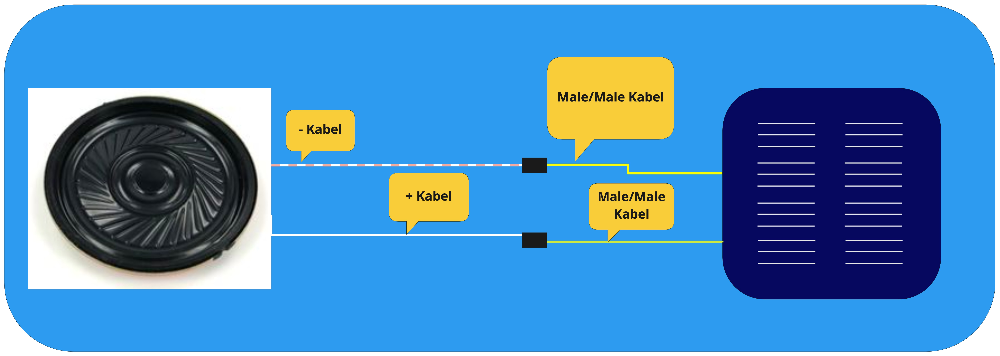

# Vibration-Sound-Light Transformation 

---
## 5 Minuten Zeit um 

1. kleinen Schraubenzieher zu holen, der in die Solarzellenschrauben passt
2. Stroboskopapp auf dem Handy installieren
3. oder einen Tee zu holen oder im Chat schreiben

---

## Hardware 

---

## Zusammenbauen

## Test

1. Solarzelle mit Stroboskoplicht beleuchten
2. Finger (vorsichtig) auf Lautsprecher legen
3. Fühlt ihr was?
4. Gratuliere Dir zum Bau eines Wellen-Transformationsgeräts!

## Was kann man daraus machen?
Chat, Chat,Chat

