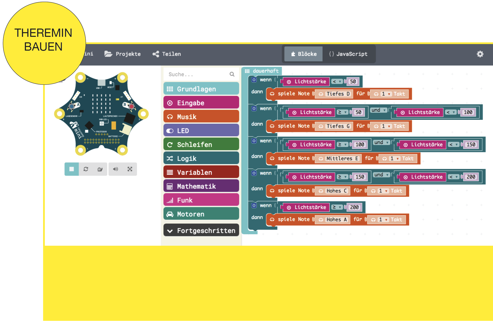

# Theremin Mini-Input

Das Theremin ist ein 1920 erfundenes elektronisches Musikinstrument. Es ist das einzige verbreitete Musikinstrument, das berührungslos gespielt wird und dabei direkt Töne erzeugt. Beim Theremin steuert die Position der Hände gegenüber zwei Elektroden (als „Antennen“ oder Spielantennen fungierende Metallstäbe als Hochfrequenzsender) die Tonhöhe sowie die Lautstärke (siehe Funktionsweise). Die Ausgabe des Tones erfolgt nach Verstärkung über einen Lautsprecher.

https://de.wikipedia.org/wiki/Theremin

## Beispiel mit dem Calliope mini

https://calliope.cc/programmieren/editoren

https://books.google.de/books?id=ibdJDwAAQBAJ&pg=PT74&lpg=PT74&dq=theremin+calliope#v=onepage&q=theremin%20calliope&f=false

Grafische Programmierung geht auch mit dem Arduino:
http://blog.ardublock.com/

## Inspiration auf Hackster, Instructables etc.

https://www.instructables.com/howto/theremin/
https://www.hackster.io/search?i=projects&q=theremin
http://www.gaudi.ch/OpenTheremin/
https://www.tindie.com/search/?q=theremin
