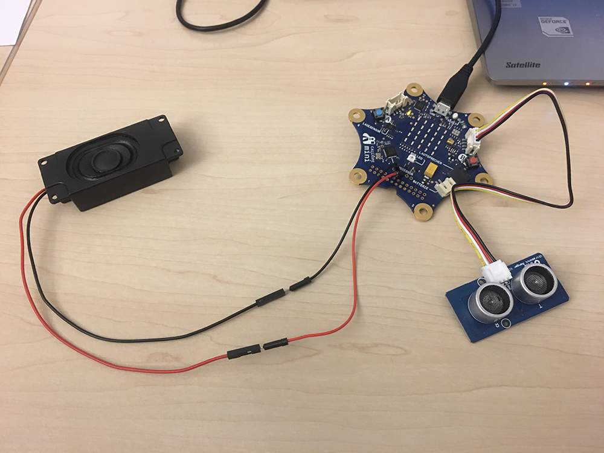

# Theremin Mini-Input

Das Theremin ist ein 1920 erfundenes elektronisches Musikinstrument. Es ist das einzige verbreitete Musikinstrument, das berührungslos gespielt wird und dabei direkt Töne erzeugt. Beim Theremin steuert die Position der Hände gegenüber zwei Elektroden (als „Antennen“ oder Spielantennen fungierende Metallstäbe als Hochfrequenzsender) die Tonhöhe sowie die Lautstärke (siehe Funktionsweise). Die Ausgabe des Tones erfolgt nach Verstärkung über einen Lautsprecher.

https://de.wikipedia.org/wiki/Theremin

## Beispiel mit dem Calliope mini

https://calliope.cc/programmieren/editoren

Der Lichtsensor ist beim Calliope mini kein eigenständiges Bauteil. Stattdessen sind LEDs nicht nur zur Erzeugung von Licht geeignet sondern auch zur Wahrnehmung von Helligkeit. Unser Lichtsensor ist also die 5x5-LED-Matrix. 

https://books.google.de/books?id=ibdJDwAAQBAJ&pg=PT74&lpg=PT74&dq=theremin+calliope#v=onepage&q=theremin%20calliope&f=false

https://www.inf-schule.de/vernetzung/calliope/sensoren/lichtsensor

## So kann es auch aussehen

Ich zeig euch ein Video!

## Lasst euch inspirieren

Grafische Programmierung geht auch mit dem Arduino:
http://blog.ardublock.com/

Es lohnt sich, auchmal auf Hackster, Instructables & Co vorbeizuschauen:

https://www.instructables.com/howto/theremin/

https://www.hackster.io/search?i=projects&q=theremin

https://www.tindie.com/search/?q=theremin
