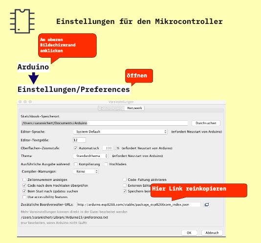
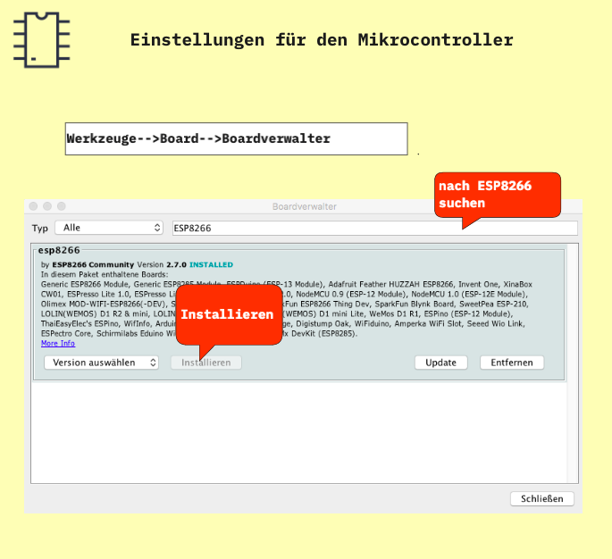
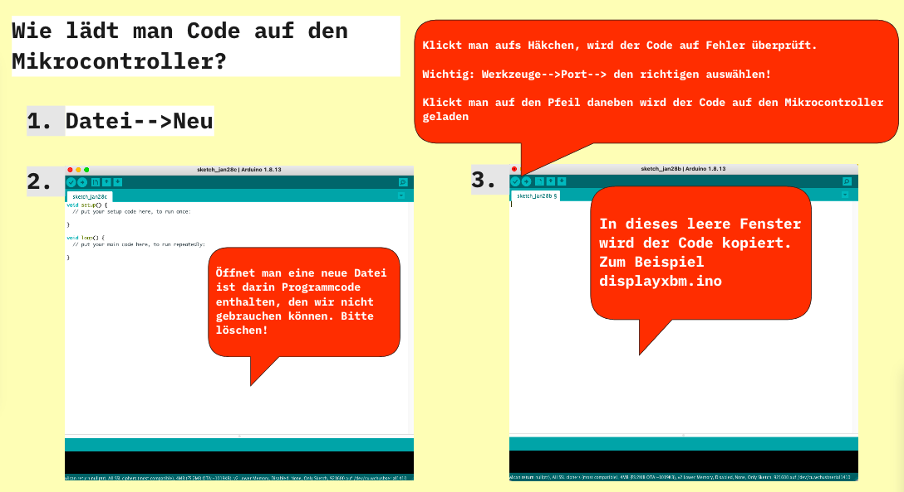
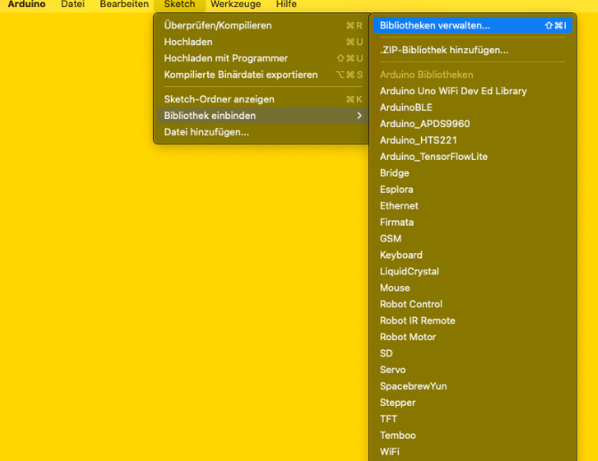
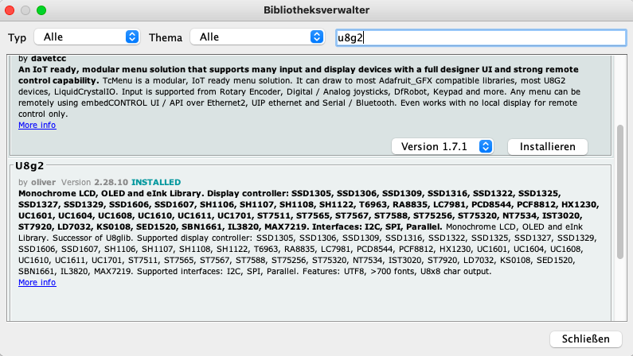

# How to get started 

## 3 Minuten Zeit, um ein Mikro USB Kabel zu holen (Handyladekabel, Powerbankkabel)

1. Download+ Install https://www.arduino.cc/en/software
2. Schreibe ein "a" in den Chat, wenn Arduino IDE startklar ist.

### Einstellungen für unseren Mikrocontroller

Diesen link kopieren und wie im Bild einsetzen: http://arduino.esp8266.com/stable/package_esp8266com_index.json

### Driver?

Treiber werden bei der Installation von Arduino mitgeliefert.

Wer einen Wemos D1-Mikrocontroller benutzt und es Probleme gibt: https://sparks.gogo.co.nz/ch340.html

### Programmieren ist... viel kopieren

Hier liegt Code zum kopieren: https://github.com/Sarapedia/werkstatt/blob/master/dialogstarter/Code/displayxbm.ino

---

### Bibliothek einbinden

Bevor alles funktioniert und ein Hund auf dem Display erscheint, brauchst Du noch eine Libary

Im Boardverwalter nach u8g2 suchen

---

## Startklar! Teste Dein Programm

1. Richtiger Port eingestellt?
2. Stecker drin?
3. Go! Lade den Code hoch!
4. Stecker rein Stecker raus. Fertig!

