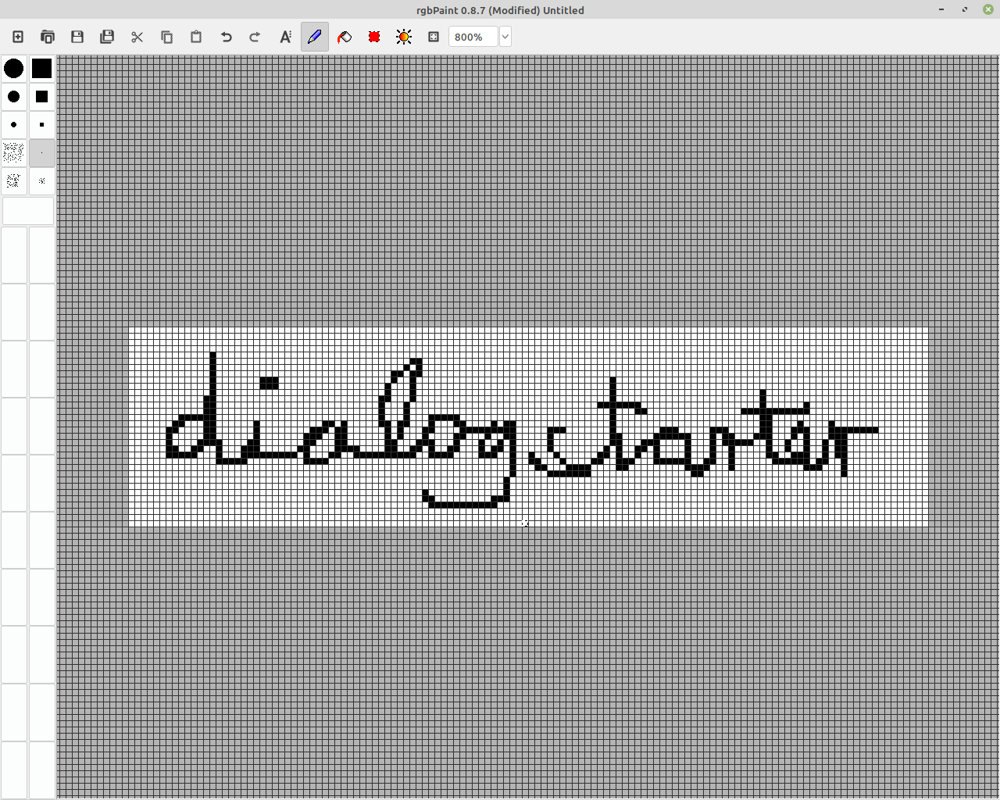

# Display 

## Text ausgeben

1. Lade displaytext.ino auf den Controller : https://github.com/Sarapedia/werkstatt/blob/master/dialogstarter/Code/TextDisplay.ino

```
void loop(void) {
  u8g2.clearBuffer();					// clear the internal memory
  u8g2.setFont(u8g2_font_ncenB08_tr);	// choose a suitable font
  u8g2.drawStr(0,10,"Morgen ist");	// write something to the internal memory
  u8g2.drawStr(50,20,"Samstag");
  u8g2.sendBuffer();					// transfer internal memory to the display
  delay(3000);  
}
```
2. Schreibe eigenen Text:
`u8g2.drawStr(x, y, "blabla");`  x,y geben die Position des Texts an. Wobei x eine Zahle zwischen 0 und 128 ist und y eine Zahl zwischen 0 und 32

## Bilder ausgeben

1. Lade die Datei displayxpm.ino auf den Controller: https://github.com/Sarapedia/werkstatt/blob/master/dialogstarter/Code/displayxbm.ino
2. Füge deinen eigenen Icon ein

## Das .xbm Format funktioniert gut! So sieht ein Pferd aus


```
#define tier_width 32
#define tier_height 32
static unsigned char tier_bits[] = {
   0x00, 0x00, 0x00, 0x00, 0x00, 0x00, 0x00, 0x00,
   0x00, 0x00, 0x00, 0x00, 0x00, 0x00, 0x00, 0x00,
   0x00, 0x00, 0x00, 0x00, 0x00, 0x00, 0x00, 0x00,
   0x80, 0x00, 0x00, 0x00, 0xc0, 0x01, 0x00, 0x00,
   0x60, 0x03, 0x00, 0x00, 0x30, 0x06, 0x00, 0x00,
   0x18, 0x0c, 0x00, 0x00, 0xcc, 0x19, 0x00, 0x00,
   0xf6, 0xf1, 0xff, 0x03, 0x3e, 0xe3, 0xff, 0x07,
   0x0c, 0x06, 0xc0, 0x06, 0x00, 0x06, 0xc0, 0x06,
   0x00, 0x06, 0xc0, 0x06, 0x00, 0xfe, 0xff, 0x00,
   0x00, 0xfe, 0xff, 0x00, 0x00, 0x06, 0xc0, 0x00,
   0x00, 0x06, 0xc0, 0x00, 0x00, 0x06, 0xc0, 0x00,
   0x00, 0x06, 0xc0, 0x00, 0x00, 0x06, 0xc0, 0x00,
   0x00, 0x06, 0xc0, 0x00, 0x00, 0x00, 0x00, 0x00,
   0x00, 0x06, 0xc0, 0x00, 0x00, 0x00, 0x00, 0x00,
   0x00, 0x00, 0x00, 0x00, 0x00, 0x00, 0x00, 0x00,
   0x00, 0x00, 0x00, 0x00, 0x00, 0x00, 0x00, 0x00};
   */
```
Wichtig ist, dass man die Void Loop Funktion anpasst: `dog_width, dog_height, dog_bits` muss hier `tier_width, tier_height, tier_bits`heißen!

```
void loop() {
  u8g2.firstPage();
  do{
    u8g2.drawXBMP(0,0,dog_width,dog_height,dog_bits);
    delay(3000);
  }while(u8g2.nextPage());

}
```
## Wo bekomme ich .xbm Bilddatein her?

1. im Ordner : https://github.com/Sarapedia/werkstatt/blob/master/dialogstarter/xbmexamples.md

2. Wenn Du python hast, dann kannst Du Dir mit dem xbm- Editor (siehe unten selber Bilder erzeugen)
3. Kein Python? Bestell dein Wunschbild bei einem Teilnehmer, der Python hat. Das Bild kann in den Ordner xbmexamples.md hoch und runtergeladen werden.


   
   


## xbm Editor

just run it in your python environment
https://sourceforge.net/projects/simple-xbm-image-editor/files/


### Outputexample

```
#define tier_width 32
#define tier_height 32
static unsigned char tier_bits[] = {
   0x00, 0x00, 0x00, 0x00, 0x00, 0x00, 0x00, 0x00,
   0x00, 0x00, 0x00, 0x00, 0x00, 0x00, 0x00, 0x00,
   0x00, 0x00, 0x00, 0x00, 0x00, 0x00, 0x00, 0x00,
   0x80, 0x00, 0x00, 0x00, 0xc0, 0x01, 0x00, 0x00,
   0x60, 0x03, 0x00, 0x00, 0x30, 0x06, 0x00, 0x00,
   0x18, 0x0c, 0x00, 0x00, 0xcc, 0x19, 0x00, 0x00,
   0xf6, 0xf1, 0xff, 0x03, 0x3e, 0xe3, 0xff, 0x07,
   0x0c, 0x06, 0xc0, 0x06, 0x00, 0x06, 0xc0, 0x06,
   0x00, 0x06, 0xc0, 0x06, 0x00, 0xfe, 0xff, 0x00,
   0x00, 0xfe, 0xff, 0x00, 0x00, 0x06, 0xc0, 0x00,
   0x00, 0x06, 0xc0, 0x00, 0x00, 0x06, 0xc0, 0x00,
   0x00, 0x06, 0xc0, 0x00, 0x00, 0x06, 0xc0, 0x00,
   0x00, 0x06, 0xc0, 0x00, 0x00, 0x00, 0x00, 0x00,
   0x00, 0x06, 0xc0, 0x00, 0x00, 0x00, 0x00, 0x00,
   0x00, 0x00, 0x00, 0x00, 0x00, 0x00, 0x00, 0x00,
   0x00, 0x00, 0x00, 0x00, 0x00, 0x00, 0x00, 0x00};
```

## Imagemagick geht auch!

https://imagemagick.org/script/download.php
https://imagemagick.org/script/command-line-processing.php




Datei als BMP oder ICO speichern

`convert convert dialog.ico dialog.xbm`


```
#define my_width 128
#define my_height 32
static char my_bits[] = {
  0x00, 0x00, 0x00, 0x00, 0x00, 0x00, 0x00, 0x00, 0x00, 0x00, 0x00, 0x00, 
  0x00, 0x00, 0x00, 0x00, 0x00, 0x00, 0x00, 0x00, 0x00, 0x00, 0x00, 0x00, 
  0x00, 0x00, 0x00, 0x00, 0x00, 0x00, 0x00, 0x00, 0x00, 0x00, 0x00, 0x00, 
  0x00, 0x00, 0x00, 0x00, 0x00, 0x00, 0x00, 0x00, 0x00, 0x00, 0x00, 0x00, 
  0x00, 0x00, 0x00, 0x00, 0x00, 0x00, 0x00, 0x00, 0x00, 0x00, 0x00, 0x00, 
  0x00, 0x00, 0x00, 0x00, 0x00, 0x00, 0x00, 0x00, 0x00, 0x00, 0x00, 0x00, 
  0x00, 0x00, 0x00, 0x00, 0x00, 0x00, 0x00, 0x00, 0x00, 0x00, 0x00, 0x00, 
  0x00, 0x00, 0x00, 0xDE, 0x00, 0x00, 0x00, 0x00, 0x00, 0x00, 0x00, 0x00, 
  0x00, 0x00, 0x00, 0x00, 0x00, 0x00, 0xC0, 0xF3, 0x03, 0x00, 0x00, 0x00, 
  0x00, 0x00, 0x00, 0x00, 0x00, 0x00, 0x00, 0x00, 0x00, 0x00, 0x78, 0x00, 
  0x0E, 0x00, 0x00, 0x00, 0x00, 0x00, 0x00, 0x00, 0x00, 0x00, 0x00, 0x00, 
  0x00, 0x00, 0x0C, 0x00, 0x0E, 0x00, 0x00, 0x00, 0x00, 0x00, 0x00, 0x00, 
  0x00, 0x00, 0x00, 0x00, 0x00, 0x00, 0x06, 0x00, 0x0A, 0x00, 0x00, 0x00, 
  0x00, 0x00, 0x00, 0x00, 0x00, 0x00, 0x00, 0x00, 0x00, 0x9C, 0x83, 0x00, 
  0x08, 0x00, 0x00, 0x00, 0x00, 0x00, 0x00, 0x00, 0x00, 0x00, 0x00, 0x00, 
  0x00, 0xF7, 0x81, 0x00, 0x08, 0x00, 0x00, 0x00, 0x00, 0x00, 0x00, 0x00, 
  0x00, 0x00, 0x00, 0x00, 0x80, 0x01, 0x01, 0x40, 0x08, 0x00, 0x00, 0x00, 
  0x00, 0x00, 0x00, 0x00, 0x00, 0x00, 0x00, 0x00, 0x40, 0x00, 0x01, 0x00, 
  0x1C, 0x00, 0x00, 0x00, 0x00, 0x00, 0x00, 0x00, 0x00, 0x00, 0x00, 0x00, 
  0x60, 0x80, 0xC3, 0x7B, 0x7C, 0x00, 0x00, 0x00, 0x00, 0x00, 0x00, 0x00, 
  0x00, 0x00, 0x00, 0x00, 0x60, 0x00, 0x03, 0x1E, 0x84, 0x01, 0x00, 0x00, 
  0x00, 0x00, 0x00, 0x00, 0x00, 0x00, 0x00, 0x00, 0x60, 0x00, 0x0C, 0x00, 
  0x04, 0x01, 0x00, 0x00, 0x00, 0x00, 0x00, 0x00, 0x00, 0x00, 0x00, 0x00, 
  0x20, 0x00, 0x78, 0x85, 0x06, 0x01, 0x00, 0x00, 0x00, 0x00, 0x00, 0x00, 
  0x00, 0x00, 0x00, 0x00, 0x20, 0x00, 0xE0, 0xFF, 0x03, 0x03, 0x00, 0x00, 
  0x00, 0x00, 0x00, 0x00, 0x00, 0x00, 0x00, 0x00, 0x20, 0x00, 0x00, 0x00, 
  0x00, 0x02, 0x00, 0x00, 0x00, 0x00, 0x00, 0x00, 0x00, 0x00, 0x00, 0x00, 
  0x30, 0x00, 0x00, 0x00, 0x00, 0x02, 0x00, 0x00, 0x00, 0x00, 0x00, 0x00, 
  0x00, 0x00, 0x00, 0x00, 0x10, 0x00, 0x00, 0x00, 0x00, 0x06, 0x00, 0x00, 
  0x00, 0x00, 0x00, 0x00, 0x00, 0x00, 0x00, 0x00, 0x10, 0x00, 0x00, 0x00, 
  0x00, 0x02, 0x00, 0x00, 0x00, 0x00, 0x00, 0x00, 0x00, 0x00, 0x00, 0x00, 
  0x10, 0x00, 0x00, 0x00, 0x00, 0x06, 0x00, 0x00, 0x00, 0x00, 0x00, 0x00, 
  0x00, 0x00, 0x00, 0x00, 0x18, 0x00, 0x00, 0x00, 0x00, 0x02, 0x00, 0x00, 
  0x00, 0x00, 0x00, 0x00, 0x00, 0x00, 0x00, 0x00, 0x10, 0x00, 0x00, 0x00, 
  0x00, 0x06, 0x00, 0x00, 0x00, 0x00, 0x00, 0x00, 0x00, 0x00, 0x00, 0x00, 
  0x00, 0x00, 0x00, 0x00, 0x00, 0x02, 0x00, 0x00, 0x00, 0x00, 0x00, 0x00, 
  0x00, 0x00, 0x00, 0x00, 0x00, 0x00, 0x00, 0x00, 0x00, 0x02, 0x00, 0x00, 
  0x00, 0x00, 0x00, 0x00, 0x00, 0x00, 0x00, 0x00, 0x00, 0x00, 0x00, 0x00, 
  0x00, 0x02, 0x00, 0x00, 0x00, 0x00, 0x00, 0x00, 0x00, 0x00, 0x00, 0x00, 
  0x00, 0x00, 0x00, 0x00, 0x00, 0x00, 0x00, 0x00, 0x00, 0x00, 0x00, 0x00, 
  0x00, 0x00, 0x00, 0x00, 0x00, 0x00, 0x00, 0x00, 0x00, 0x00, 0x00, 0x00, 
  0x00, 0x00, 0x00, 0x00, 0x00, 0x00, 0x00, 0x00, 0x00, 0x00, 0x00, 0x00, 
  0x00, 0x00, 0x00, 0x00, 0x00, 0x00, 0x00, 0x00, };

```

In den Arduino Sketch kopieren und `unsigned` hinzufügen, so dass da `static unsigned char my_bits[] = {` steht

Natürlich lässt sich auch direkt ein Logo konvertieren und in der Größe anpassen:

`convert -resize 128x dialogstarter_logo.png dailogstarter_logo.xbm`

```

#define dialogstarter_logo_width 128
#define dialogstarter_logo_height 69
static char dialogstarter_logo_bits[] = {
  0x00, 0x00, 0x00, 0x00, 0x00, 0x00, 0x00, 0x00, 0x00, 0x00, 0x00, 0x00, 
  0x00, 0x00, 0x00, 0x00, 0x00, 0x00, 0x00, 0x00, 0x00, 0x00, 0x00, 0x00, 
  0x00, 0x00, 0x00, 0x00, 0x00, 0x00, 0x00, 0x00, 0x00, 0x00, 0x00, 0x00, 
  0x00, 0x00, 0x00, 0x00, 0x00, 0x00, 0x00, 0x00, 0x00, 0x00, 0x00, 0x00, 
  0x00, 0x00, 0x00, 0x00, 0x00, 0x00, 0x2A, 0x00, 0x00, 0x00, 0x00, 0x00, 
  0x00, 0x00, 0x00, 0x00, 0x00, 0x00, 0x00, 0x00, 0x00, 0xE0, 0xFF, 0x07, 
  0x00, 0xF8, 0x1F, 0x00, 0x00, 0x00, 0x00, 0x00, 0x00, 0x00, 0x00, 0x00, 
  0x00, 0x7C, 0x8E, 0x1F, 0x80, 0xFF, 0xF9, 0x00, 0x00, 0x00, 0x00, 0x00, 
  0x00, 0x00, 0x00, 0x00, 0xEA, 0x1F, 0xC7, 0x31, 0xC0, 0xF9, 0x81, 0x5F, 
  0x00, 0x00, 0x00, 0x00, 0x00, 0x00, 0x60, 0xFF, 0xFF, 0x8F, 0xE3, 0xF8, 
  0xF0, 0x27, 0xFE, 0xFE, 0xFF, 0x5D, 0x00, 0x00, 0x00, 0x00, 0xE4, 0xFF, 
  0x7F, 0xC7, 0x71, 0x9C, 0xFF, 0x03, 0x7E, 0xF0, 0xFF, 0x3F, 0x00, 0x00, 
  0x00, 0x00, 0x00, 0xA0, 0xBF, 0xE3, 0x38, 0x8E, 0xF1, 0x07, 0x7E, 0xE0, 
  0x1F, 0x00, 0x00, 0x00, 0x00, 0x00, 0x00, 0x60, 0xEF, 0x71, 0x9C, 0xE7, 
  0xF0, 0x07, 0x7E, 0xE0, 0x1B, 0x00, 0x00, 0x00, 0x00, 0x00, 0xF5, 0xFF, 
  0xE7, 0x3C, 0x8F, 0x63, 0xE6, 0x03, 0x7E, 0xE0, 0xFF, 0xDF, 0x02, 0x00, 
  0x00, 0x80, 0xFF, 0xFF, 0x37, 0x0E, 0xE3, 0x30, 0xCE, 0x03, 0x7E, 0xE0, 
  0xFF, 0xFF, 0x07, 0x00, 0x00, 0x00, 0x00, 0xF5, 0x3F, 0xCE, 0x61, 0x3C, 
  0x9E, 0x6D, 0xB5, 0x96, 0xFF, 0x06, 0x00, 0x00, 0x00, 0x00, 0x00, 0xF8, 
  0x8F, 0xE3, 0x79, 0x0E, 0x1E, 0xF8, 0x81, 0x3F, 0x3C, 0x00, 0x00, 0x00, 
  0x00, 0x80, 0xFA, 0xFF, 0xC7, 0x71, 0x1C, 0x07, 0x1E, 0xFC, 0x81, 0x1F, 
  0xFC, 0xFF, 0x05, 0x00, 0x00, 0xE8, 0xFF, 0xFF, 0xE3, 0x38, 0x8E, 0xE3, 
  0x1F, 0xF8, 0x81, 0x3F, 0xF8, 0xFF, 0x3F, 0x00, 0x00, 0x00, 0x40, 0xFF, 
  0x71, 0x1C, 0xC7, 0xE1, 0x1F, 0xFC, 0x81, 0x1F, 0xF8, 0x37, 0x00, 0x00, 
  0x00, 0x00, 0x00, 0xFC, 0x38, 0x8E, 0xE3, 0xF0, 0xFF, 0xF8, 0x81, 0x1F, 
  0xF8, 0x00, 0x00, 0x00, 0x00, 0x80, 0xFE, 0x7F, 0x1C, 0xE7, 0x71, 0xF0, 
  0xFD, 0xFC, 0x81, 0x3F, 0xF8, 0xFF, 0x05, 0x00, 0x00, 0xF4, 0xFF, 0x7F, 
  0x8E, 0xE3, 0x38, 0xF3, 0xF0, 0x04, 0x7E, 0xE0, 0xFF, 0xFF, 0xFF, 0x00, 
  0x00, 0x00, 0xF0, 0x3F, 0xE7, 0x39, 0x1C, 0xFB, 0xF0, 0x01, 0x7E, 0xE0, 
  0xFF, 0x6F, 0x00, 0x00, 0x00, 0x00, 0x00, 0xFE, 0xE3, 0x18, 0xCF, 0xF9, 
  0xF0, 0x01, 0x7F, 0xE0, 0xEF, 0x01, 0x00, 0x00, 0x00, 0x80, 0xFF, 0xFF, 
  0x38, 0x9E, 0xC3, 0xF1, 0xFD, 0x01, 0x7E, 0xC0, 0xFF, 0xFF, 0x03, 0x00, 
  0x00, 0xFC, 0xFF, 0xFF, 0x1C, 0xC7, 0x71, 0xE0, 0xFF, 0x03, 0x7E, 0xE0, 
  0xEF, 0xFF, 0xFF, 0x01, 0x00, 0x00, 0xFA, 0x3F, 0x8E, 0xE3, 0x38, 0xE0, 
  0xFF, 0x01, 0x7E, 0xC0, 0xEF, 0xBF, 0x03, 0x00, 0x00, 0x00, 0x00, 0x3E, 
  0xC7, 0x71, 0x1C, 0xF1, 0xFF, 0xF9, 0x81, 0x3F, 0xF8, 0x01, 0x00, 0x00, 
  0x00, 0x00, 0xF6, 0xBF, 0xE3, 0x38, 0x8E, 0x79, 0xFF, 0xF9, 0x81, 0x1F, 
  0xF0, 0x7F, 0x05, 0x00, 0x00, 0xFC, 0xFF, 0xFF, 0x71, 0x1C, 0xC7, 0x39, 
  0xBC, 0xF9, 0x81, 0x3F, 0xF0, 0xFF, 0xFF, 0x01, 0x00, 0x80, 0xFD, 0xFF, 
  0x38, 0x8E, 0xF3, 0x18, 0x0C, 0xFB, 0x81, 0x1F, 0xF0, 0xFF, 0x05, 0x00, 
  0x00, 0x00, 0x00, 0x7E, 0x1C, 0xC7, 0x71, 0x38, 0x0C, 0xF8, 0x81, 0x1F, 
  0xF8, 0x00, 0x00, 0x00, 0x00, 0x00, 0xE4, 0x3F, 0xC7, 0x71, 0x1C, 0x7A, 
  0x1F, 0xFC, 0x81, 0x3F, 0xF0, 0x6F, 0x01, 0x00, 0x00, 0xF8, 0xFF, 0x7F, 
  0xE3, 0x39, 0x9E, 0xF3, 0xBF, 0x25, 0xEE, 0xC2, 0xFD, 0xFF, 0xFF, 0x00, 
  0x00, 0x80, 0xFE, 0xFF, 0x73, 0x1C, 0xC7, 0xF1, 0xFF, 0x00, 0x7E, 0xE0, 
  0xFF, 0xFF, 0x09, 0x00, 0x00, 0x00, 0x00, 0xFC, 0x38, 0x8E, 0xE3, 0xF0, 
  0xFF, 0x06, 0x7E, 0xE0, 0xFF, 0x00, 0x00, 0x00, 0x00, 0x00, 0xA0, 0xFD, 
  0x1C, 0xC7, 0x71, 0xE4, 0x7E, 0x02, 0x7E, 0xE0, 0xFF, 0x1F, 0x00, 0x00, 
  0x00, 0xF0, 0xFF, 0xFF, 0x8E, 0xE3, 0x38, 0x6E, 0x78, 0x06, 0x7E, 0xE0, 
  0xFF, 0xFF, 0x1F, 0x00, 0x00, 0x00, 0xFD, 0xFF, 0xC7, 0x71, 0x1C, 0x07, 
  0x78, 0x03, 0x7F, 0xE0, 0xFF, 0xFF, 0x06, 0x00, 0x00, 0x00, 0x00, 0xD0, 
  0xE3, 0x38, 0x8E, 0x43, 0x3C, 0x96, 0x9E, 0x92, 0x5F, 0x00, 0x00, 0x00, 
  0x00, 0x00, 0x00, 0xFD, 0x73, 0x1C, 0xC7, 0x91, 0x1E, 0xFC, 0x81, 0x1F, 
  0xFE, 0x02, 0x00, 0x00, 0x00, 0x80, 0xFF, 0xFF, 0x3F, 0xCF, 0xF3, 0x1C, 
  0x1F, 0xF8, 0x81, 0x3F, 0xFF, 0xFF, 0x0B, 0x00, 0x00, 0x00, 0xF4, 0xFF, 
  0x8F, 0xC3, 0x30, 0x1E, 0x06, 0xFC, 0x81, 0x9F, 0xFF, 0xBF, 0x02, 0x00, 
  0x00, 0x00, 0x00, 0x28, 0xCF, 0xF3, 0x3C, 0xC7, 0x02, 0xFC, 0x81, 0xBF, 
  0x15, 0x00, 0x00, 0x00, 0x00, 0x00, 0x00, 0xC0, 0xFF, 0x38, 0x8E, 0xE3, 
  0x08, 0xF8, 0x81, 0xFF, 0x4F, 0x00, 0x00, 0x00, 0x00, 0x00, 0xF8, 0xFF, 
  0x7F, 0x1C, 0xC7, 0x71, 0x0B, 0xFC, 0x81, 0xFF, 0xFF, 0x7F, 0x00, 0x00, 
  0x00, 0x00, 0x88, 0xFF, 0xFF, 0x8E, 0xE3, 0xF8, 0xF9, 0x03, 0x7E, 0xF8, 
  0xFF, 0x1B, 0x00, 0x00, 0x00, 0x00, 0x00, 0x00, 0xE4, 0xC7, 0x71, 0x7C, 
  0xE0, 0x07, 0x7E, 0x7F, 0x01, 0x00, 0x00, 0x00, 0x00, 0x00, 0x00, 0x00, 
  0x00, 0xFE, 0x38, 0x3E, 0x80, 0x07, 0xFE, 0x01, 0x00, 0x00, 0x00, 0x00, 
  0x00, 0x00, 0x00, 0x00, 0x00, 0xF8, 0xDF, 0x07, 0x00, 0xFC, 0x3F, 0x00, 
  0x00, 0x00, 0x00, 0x00, 0x00, 0x00, 0x40, 0x08, 0x00, 0x00, 0x7E, 0x00, 
  0x00, 0x08, 0x00, 0x00, 0x00, 0x00, 0x00, 0x00, 0x00, 0x00, 0xC0, 0x0C, 
  0x00, 0x07, 0x00, 0x00, 0x00, 0x0C, 0x00, 0x80, 0x03, 0x00, 0x00, 0x00, 
  0x00, 0x00, 0xC0, 0x0C, 0x00, 0x06, 0x00, 0x00, 0x00, 0x0C, 0x00, 0x80, 
  0x01, 0x00, 0x00, 0x00, 0x00, 0x00, 0xEE, 0x00, 0x06, 0x06, 0x03, 0x8C, 
  0x30, 0x1E, 0x0C, 0xA4, 0x83, 0x01, 0x00, 0x00, 0x00, 0x00, 0xFF, 0x8E, 
  0x7F, 0xC7, 0x0F, 0xFF, 0x78, 0x3E, 0xFF, 0xFE, 0xE7, 0xC7, 0x07, 0x00, 
  0x00, 0x80, 0xF3, 0xCC, 0x7B, 0xE6, 0x1E, 0xFB, 0xFC, 0x9E, 0xF7, 0x9E, 
  0x77, 0xCE, 0x03, 0x00, 0x00, 0x80, 0xE1, 0xEC, 0x70, 0x76, 0xB8, 0xC3, 
  0x0D, 0xCC, 0xE1, 0x8C, 0x31, 0xCC, 0x01, 0x00, 0x00, 0xC0, 0xC0, 0xEE, 
  0x70, 0x36, 0xB0, 0xC1, 0x3C, 0xCC, 0xC0, 0x0C, 0xFB, 0xDF, 0x00, 0x00, 
  0x00, 0xC0, 0xC1, 0x6C, 0x60, 0x77, 0xB8, 0xC1, 0xF0, 0xCC, 0xC0, 0x86, 
  0xF9, 0xDF, 0x01, 0x00, 0x00, 0xC0, 0xC1, 0xEE, 0x60, 0x76, 0xB8, 0xC1, 
  0xC1, 0xCC, 0xE1, 0x8E, 0x39, 0xC0, 0x01, 0x00, 0x00, 0x80, 0xE3, 0xCC, 
  0x71, 0xE7, 0x98, 0xE3, 0xDC, 0xCC, 0xF3, 0x8C, 0x73, 0xCC, 0x00, 0x00, 
  0x00, 0x00, 0xFF, 0xCC, 0x7F, 0xE6, 0x1F, 0xFF, 0xFD, 0x8C, 0xFF, 0x8E, 
  0xE3, 0xCF, 0x01, 0x00, 0x00, 0x00, 0xDE, 0x0C, 0x6F, 0x82, 0x07, 0xDE, 
  0x78, 0x0C, 0xCE, 0x04, 0xC1, 0x87, 0x00, 0x00, 0x00, 0x00, 0x00, 0x00, 
  0x00, 0x00, 0x00, 0xC0, 0x00, 0x00, 0x00, 0x00, 0x00, 0x00, 0x00, 0x00, 
  0x00, 0x00, 0x00, 0x00, 0x00, 0x00, 0x80, 0xFF, 0x00, 0x00, 0x00, 0x00, 
  0x00, 0x00, 0x00, 0x00, 0x00, 0x00, 0x00, 0x00, 0x00, 0x00, 0x00, 0x7F, 
  0x00, 0x00, 0x00, 0x00, 0x00, 0x00, 0x00, 0x00, 0x00, 0x00, 0x00, 0x00, 
  0x00, 0x00, 0x00, 0x00, 0x00, 0x00, 0x00, 0x00, 0x00, 0x00, 0x00, 0x00, 
  0x00, 0x00, 0x00, 0x00, 0x00, 0x00, 0x00, 0x00, 0x00, 0x00, 0x00, 0x00, 
  0x00, 0x00, 0x00, 0x00, 0x00, 0x00, 0x00, 0x00, 0x00, 0x00, 0x00, 0x00, 
  0x00, 0x00, 0x00, 0x00, 0x00, 0x00, 0x00, 0x00, 0x00, 0x00, 0x00, 0x00, 
  0x00, 0x00, 0x00, 0x00, 0x00, 0x00, 0x00, 0x00, 0x00, 0x00, 0x00, 0x00, 
  };

```

---

# Dialogstarter

Kann ich Ihnen
duzen?


Warum spreche
ich nicht? Willst
du das wissen?,
„Ja, ich bin taub
und es ist auch
nicht schlimm,
dafür gibt es ja
hier.


Du wirst auf eine
einsame Insel
verbannt und
darfst nur einen
Gegenstand
mitnehmen.
Welcher wäre
das?


Erzähl drei lustige
Sachen über dich
selbst in
Gestikulieren, was
ich wissen soll!

Warum sprichst
du mich an?

Wie, glaubst du,
hört sich Musik
an?


Darfst du Auto
fahren?


Was ist taube
Kultur?


Mann, hier ist es
voll, nicht wahr?


Sieht’s aus, dass
wir zur Party
gehen, vielleicht
zur derselben
Party? :)

Was ist deine
Labels?

Haben wir
eigentlich wirklich
Kommunikationspr
oblem?

Kannst Du mir was
ganz Einfaches in
Gebärdensprache
beibringen?


Wie ist, Sex zu
haben, ohne das
Stöhnen des
Partners zu
hören?


Wie flirtest du?


Zeig mir wie ich
mit dir
kommunizieren
kann!


Wie fühlst du dich
denn als du grad
in der Situation
mit einer tauben
Person bist?


Was ist dir lieber:
Taub oder blind?

Kannst du
schreiben oder
gebärden?


Ich spreche in
Gebärdensprache
und was ist deine
Muttersprache?

Ist die
Gebärdensprache
international?

Wie war es für
deine Eltern zu
merken, dass du
gehörlos bist?

Wenn du ein
Geräusch hören
könntest, welches
würdest du dir
wünschen?

Gibt es eine
Kulturkonflikt
zwischen tauben
und hörenden
Menschen?


Wenn du Chef der
BVG wärst, was
würdest du
ändern?

Gibt es eine
Erfahrung, die
dein Leben
nachhaltig
verändert hat?

Hast du dich
schon einmal mit
taube Person
getroffen?

Ist eine
Paarbeziehung
zwischen tauben
und hörenden
möglich?

Kannst du den
Lippen ablesen?


Lebst du in einer
Parallelgesellschaf
t?

Wann macht dir
die Stille Angst?

Ist es schwer,
Gebärdensprache
zu lernen?

Wie kann die
BVG uns „lieben“,
obwohl sie sich
immer verspätet
und sich als
unzuverlässig
erweist?


Was haltest du
davon, dass ein/e
Fremde/r dich
anspricht?

Bist du jetzt frisch,
mit mir zur Café
zu gehen?

Ist es schwer,
Lautsprache und
lippelesen zu
lernen?


Ist es unangenehm,
in der Öffentlichkeit
Gebärdensprache
zu benutzen, weil
dich alle anstarren?


Gebärdensprache
wird vorgeworfen,
sehr primitiv zu
sein. Redest du
primitiv?

Was muss ich
noch beachten,
bevor ich mit dir
zur Café gehe?

Was denkst du
über die
Hörenden?

