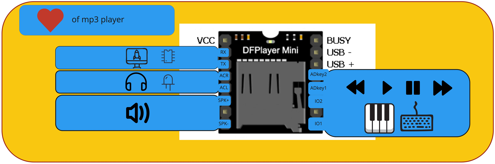
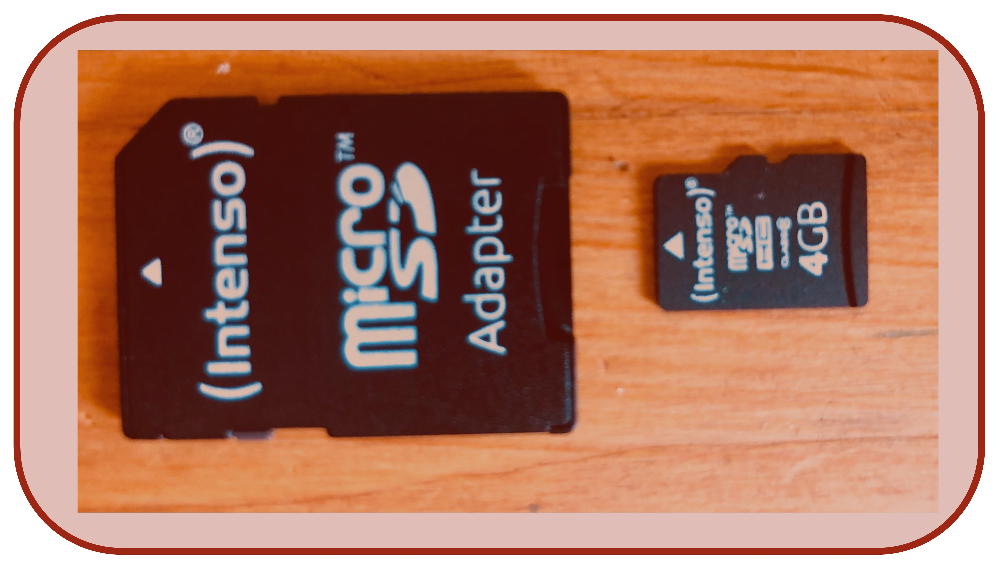
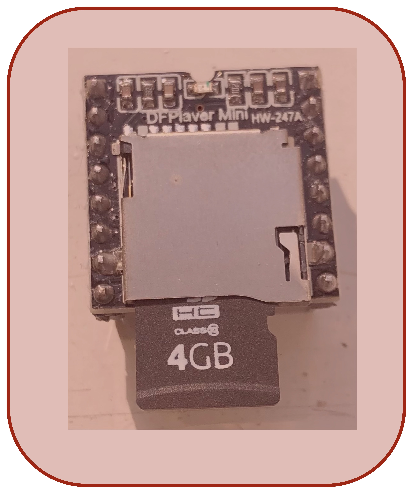
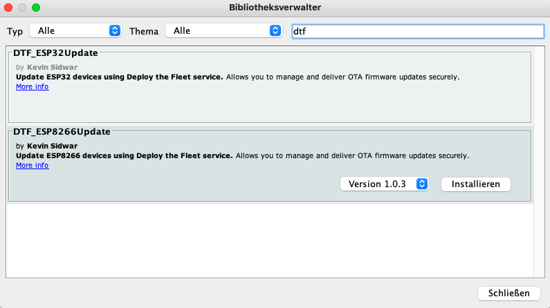
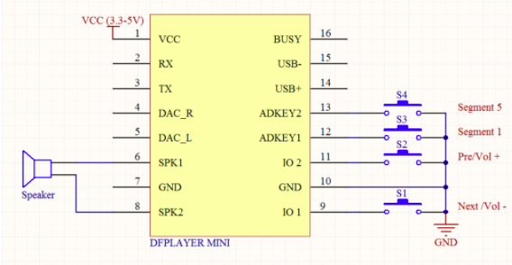
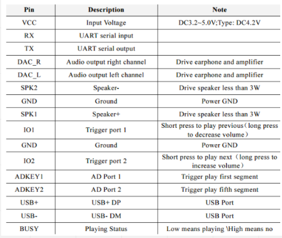

# DTF mp3 Player- HowTo

## Der mp3 player kann über den Mikrocontroller gesteuert werden, geht aber auch ohne.

### Step 1: Hardware

---

### Step 2: Copy mp3 data to SD-Card

[animal sounds for testing] (https://freeanimalsounds.org/de/bauernhof/)

---

### Step 3: Insert SD Cart to dtf Player

---

### Step 4: dtf Bibliothek einbinden und Test-Code hochladen

1. nach dtf im Bibliothekenmanager suchen. Siehe Bild
2. Installieren
3. mp3esp.ino kopieren und hochladen:  https://github.com/Sarapedia/werkstatt/blob/master/dialogstarter/Code/mp3esp.ino
4. den Finger vorsichtig auf den Lautsprecher legen. Vibriert es?

## Bilder passend zur mp3

Hiermit können Bilder passend zur mp3 ausgegeben werden: https://github.com/Sarapedia/werkstatt/blob/master/dialogstarter/Code/mp3undbild.ino

## Code anpassen für mehr Spaß

## DTF Mini ohne Mikrocontroller steuern.

