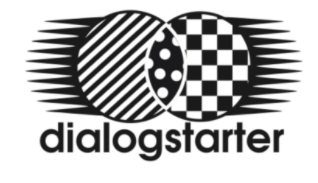
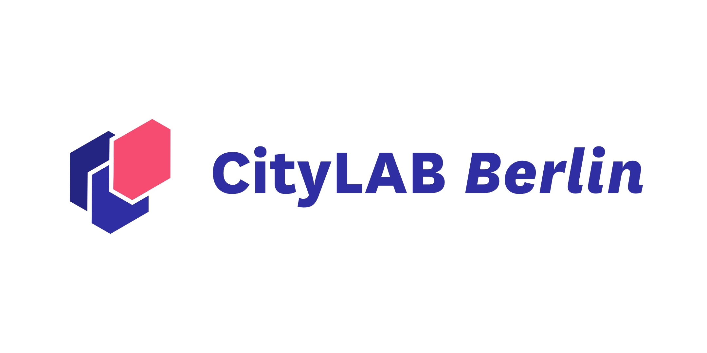
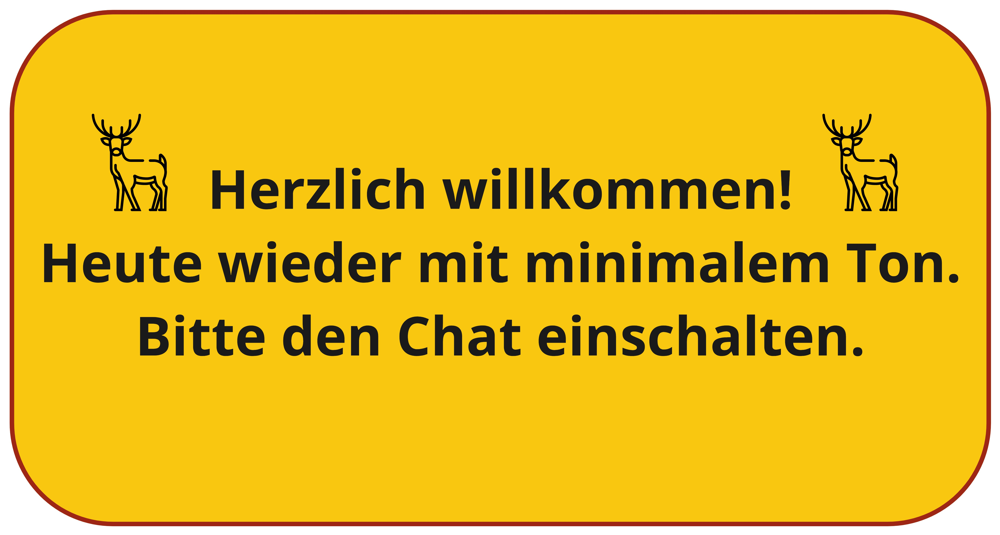
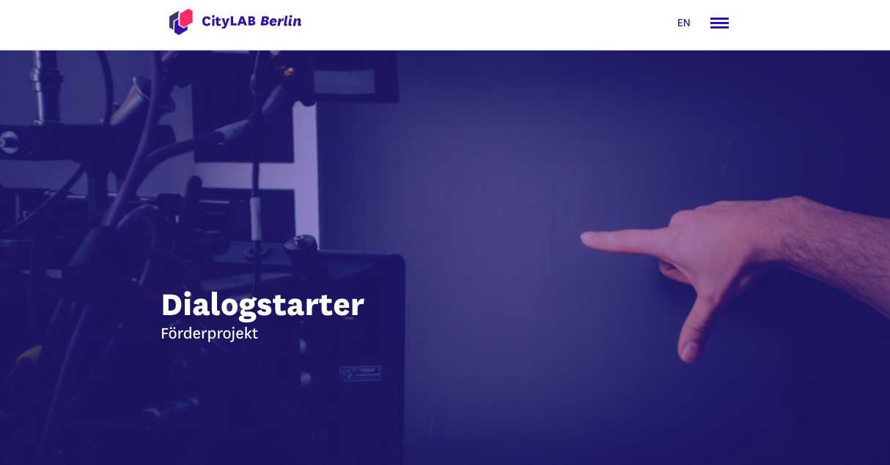
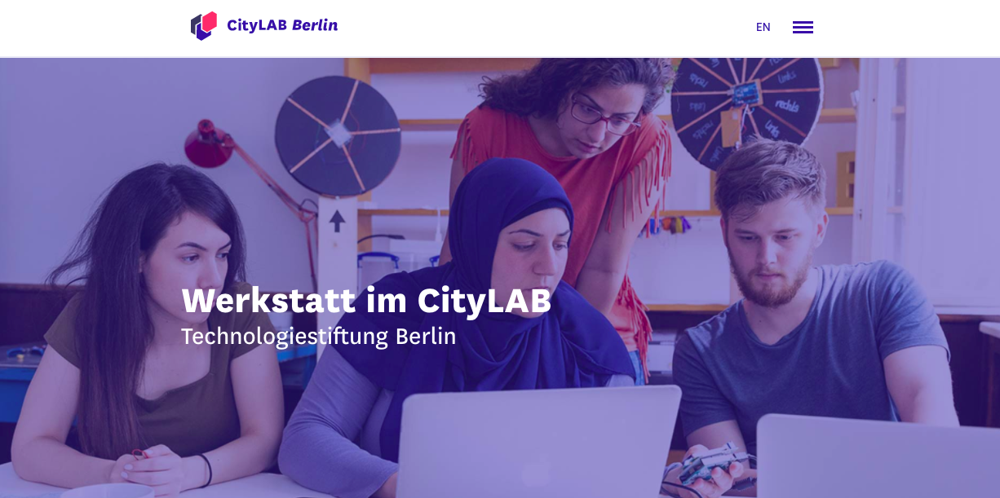
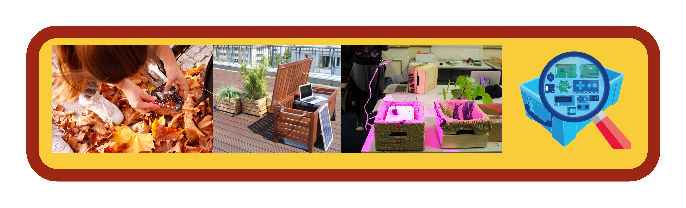
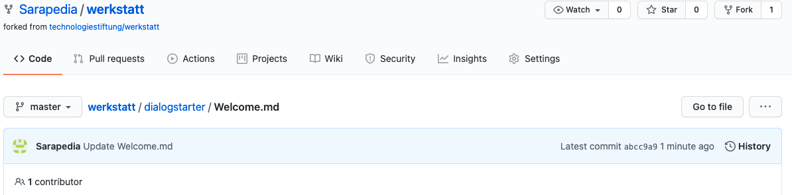

# Offene Werkstatt "Kommunikation"

---

# Wer sind wir? 
## Dialogstarter

https://www.citylab-berlin.org/projects/dialogstarter/

---

## Technologiestiftung Berlin 

https://www.citylab-berlin.org/projects/werkstatt/

### Raum für Experimente

---

# Was ist GitHub? 

## Eine Tour durch unser Repository
### Bildschirm einrichten... Vorschlag: 2 Fenster nebeneinander

---

# Github-Übung

1. Link zu Github: https://github.com/Sarapedia/werkstatt/tree/master/dialogstarter
2. öffne welcome.md : https://github.com/Sarapedia/werkstatt/blob/master/dialogstarter/Welcome.md
3. Klopfe Dir auf die Schulter und mache ein + in den Chat bei BigBlueButton
4. jetzt zum dialogstarter Hauptordner mit Hilfe vom Repositorypfad ...siehe unten

---

