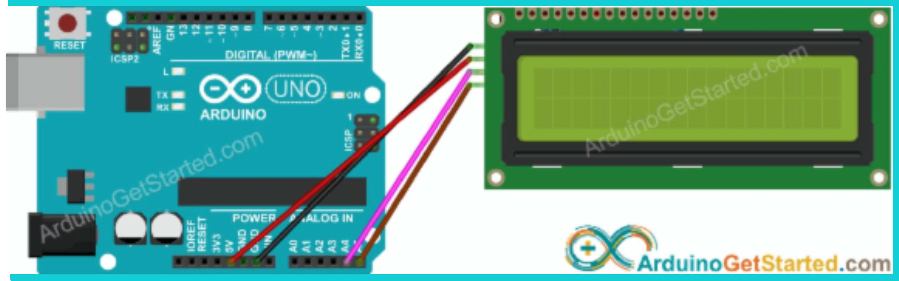

# Level 1 "Hello World"


##  Links :
 
1. Arduino  https://www.arduino.cc/en/software
2. Just copy and include like shown in the upper blue box http://arduino.esp8266.com/stable/package_esp8266com_index.json
3. You can download u8g2 libary from here if its not in Arduino Libary Manager https://github.com/olikraus/u8g2

## Troubleshooting "Level 1"

1. You use MacOS Big Sur and during upload you get an error that mentions pySerial Direction not found: https://forum.arduino.cc/t/pyserial-and-esptools-directory-error/671804/13
2. Uploaded but you can't see "Hello World" on your oled? Plug USB cable in and out.
 
# Level 2: "Upload Code from GitHub"


## Link to Asciioled

https://github.com/technologiestiftung/werkstatt/blob/master/ultratools/code/asciioled.ino

# Level 3: "Drawing with ascii" 

## How to draw a dot at a certain position

```
  void loop(void) {
  u8g2.clearBuffer(); 
  u8g2.setFont(u8g2_font_ncenB08_tr);
  u8g2.drawStr(17,4,"...."); 
  u8g2.drawStr(17,7,".  .");// write something to the internal memory
  u8g2.drawStr(17,10,"....");  // write something to the internal memory
  u8g2.drawStr(10,15,".......");  // write something to the internal memory
  u8g2.drawStr(18,16,".");
  u8g2.drawStr(18,17,".");
  u8g2.drawStr(18,18,".");  // write something to the internal memory
  u8g2.drawStr(18,19,".");
  u8g2.drawStr(18,20,".");// write something to the internal memory
  u8g2.drawStr(16,21,"..........");  // write something to the internal memory
  u8g2.drawStr(16,22,".    ");  // write something to the internal memory
  u8g2.drawStr(16,23,".    ");  // write something to the internal memory
  u8g2.drawStr(16,24,".    ");
  u8g2.drawStr(16,25,".    ");
  u8g2.drawStr(16,26,".    ");
  u8g2.drawStr(16,27,".    ");
  u8g2.drawStr(16,28,".    ");
  u8g2.drawStr(16,29,".    ");
  u8g2.drawStr(16,30,".    ");
  u8g2.drawStr(16,31,".    ");
  u8g2.drawStr(16,32,".    ");
  u8g2.sendBuffer();          // transfer internal memory to the display
  delay(4000);  
  }
  
```  
There is space for 128 dots in x direction and 32 dots in y direction


This code draws 3 dots at position x = 15 and y = 11 for 4 seconds

```
u8g2.clearBuffer(); 
u8g2.setFont(u8g2_font_ncenB08_tr);
u8g2.drawStr(15,11,"...");
u8g2.sendBuffer();          
delay(4000); 

```

## How to draw an icon - suggestion for workflow

1. open a text editor
2. create a small table (15x15 works good for the start)
3. draw your icon into that table like in the image below
4. transfer the icon into code
5. upload
6. improve code
7. upload again


This code shows you the improved dancer:  https://github.com/technologiestiftung/werkstatt/blob/master/ultratools/code/dance.ino


# Level 4: Display X-Bitmaps on oled

## Display a dog

https://github.com/Sarapedia/werkstatt/blob/master/dialogstarter/Code/displayxbm.ino

 A X-Bitmap file

```
#define dog_width 100
#define dog_height 32
static unsigned char dog_bits[] = {
   0x00, 0x00, 0x00, 0x00, 0x00, 0x00, 0x00, 0x00,
   0x00, 0x00, 0x00, 0x00, 0x00, 0x00, 0x00, 0x00,
   0x00, 0x00, 0x00, 0x00, 0x00, 0x00, 0x00, 0x00,
   0x00, 0x00, 0x00, 0x00, 0x00, 0x00, 0x00, 0x00,
   0x00, 0x00, 0x00, 0x00, 0x00, 0x00, 0x00, 0x00,
   0x00, 0x00, 0x00, 0x00, 0x00, 0x00, 0x00, 0x00,
   0x00, 0x00, 0x00, 0x00, 0x00, 0x00, 0x00, 0x00,
   0x00, 0x00, 0x00, 0x00, 0x00, 0x00, 0x00, 0x00,
   0x00, 0x00, 0x00, 0x00, 0x00, 0x00, 0x00, 0x00,
   0x00, 0x00, 0x00, 0x00, 0x00, 0x00, 0x00, 0x00,
   0x00, 0x00, 0x00, 0x00, 0x00, 0x00, 0x00, 0x00,
   0x00, 0x00, 0x00, 0x00, 0x00, 0x00, 0x00, 0x00,
   0x00, 0x00, 0x00, 0x00, 0x00, 0x00, 0x00, 0x00,
   0x00, 0x00, 0x00, 0x00, 0x00, 0x00, 0x00, 0x00,
   0x00, 0x00, 0x00, 0x00, 0x00, 0x00, 0x00, 0x00,
   0x00, 0x00, 0x00, 0x00, 0x00, 0x00, 0x00, 0x00,
   0x00, 0x00, 0x00, 0x00, 0x00, 0x00, 0x00, 0x00,
   0x00, 0x00, 0x00, 0x00, 0x00, 0x00, 0x00, 0x00,
   0x00, 0x00, 0x00, 0x00, 0x00, 0x02, 0x00, 0x00,
   0x00, 0x00, 0x00, 0x00, 0x00, 0x00, 0x00, 0x00,
   0x00, 0x00, 0x0e, 0x00, 0x00, 0x00, 0x00, 0x00,
   0x00, 0x00, 0x00, 0x00, 0x80, 0x00, 0x00, 0x3e,
   0x00, 0x00, 0x00, 0x00, 0x00, 0x00, 0x00, 0x00,
   0x00, 0x80, 0x01, 0x00, 0xf6, 0x01, 0x00, 0x00,
   0x00, 0x00, 0x00, 0x00, 0x00, 0x00, 0x00, 0x03,
   0x00, 0xc3, 0x03, 0x00, 0x00, 0x00, 0x00, 0x00,
   0x00, 0x00, 0x00, 0x00, 0x06, 0x80, 0x01, 0x03,
   0x00, 0x00, 0x00, 0x00, 0x00, 0x00, 0x00, 0x00,
   0x00, 0xfc, 0xff, 0x80, 0x03, 0x00, 0x00, 0x00,
   0x00, 0x00, 0x00, 0x00, 0x00, 0x00, 0xfc, 0x7f,
   0xc0, 0x00, 0x00, 0x00, 0x00, 0x00, 0x00, 0x00,
   0x00, 0x00, 0x00, 0x0c, 0x00, 0x60, 0x00, 0x00,
   0x00, 0x00, 0x00, 0x00, 0x00, 0x00, 0x00, 0x00,
   0x0c, 0x00, 0x30, 0x00, 0x00, 0x00, 0x00, 0x00,
   0x00, 0x00, 0x00, 0x00, 0x00, 0x0c, 0x00, 0x18,
   0x00, 0x00, 0x00, 0x00, 0x00, 0x00, 0x00, 0x00,
   0x00, 0x00, 0x0c, 0x00, 0x18, 0x00, 0x00, 0x00,
   0x00, 0x00, 0x00, 0x00, 0x00, 0x00, 0x00, 0x06,
   0x00, 0x18, 0x00, 0x00, 0x00, 0x00, 0x00, 0x00,
   0x00, 0x00, 0x00, 0x00, 0xf3, 0xff, 0x1f, 0x00,
   0x00, 0x00, 0x00, 0x00, 0x00, 0x00, 0x00, 0x00,
   0x00, 0xfb, 0xff, 0x1f, 0x00, 0x00, 0x00, 0x00,
   0x00, 0x00, 0x00, 0x00, 0x00, 0x00, 0x3f, 0x00,
   0x30, 0x00, 0x00, 0x00, 0x00, 0x00, 0x00, 0x00,
   0x00, 0x00, 0x00, 0x67, 0x00, 0x60, 0x00, 0x00,
   0x00, 0x00, 0x00, 0x00, 0x00, 0x00, 0x00, 0x00,
   0xc3, 0x00, 0xc0, 0x00, 0x00, 0x00, 0x00, 0x00,
   0x00, 0x00, 0x00, 0x00, 0x00, 0x83, 0x01, 0x80,
   0x01, 0x00, 0x00, 0x00, 0x00, 0x00, 0x00, 0x00,
   0x00, 0x00, 0x03, 0x03, 0x00, 0x03, 0x00, 0x00,
   0x00, 0x00, 0x00, 0x00, 0x00, 0x00, 0x00, 0x00,
   0x00, 0x00, 0x00, 0x00, 0x00, 0x00, 0x00, 0x00};
```   
This loop displays the dog for 3 seconds

```
void loop() {
  u8g2.firstPage();
  do{
    u8g2.drawXBMP(0,0,dog_width,dog_height,dog_bits);
    delay(3000);
  }while(u8g2.nextPage());

}

```

https://github.com/Sarapedia/werkstatt/blob/master/dialogstarter/xbmexamples.md

This loop displays the dog for 3 seconds


## How to create an X-Bitmap - One of many pipelines

1. Draw something with bold black ink for example with  https://excalidraw.com/
2. export as jpg, png, ...
3. open the image with gimp https://www.gimp.org/ 
4. Go to --> "Image" on the upper screen
5. Scale image --> 128x32 is the maximum size --> resolution: 60 
6. Go to  --> File --> export...give it a filname.xbm --> save 
7. open file in a text editor...copy all the code and paste it in Arduino Code


## Moving X-Bitmap

https://github.com/technologiestiftung/werkstatt/blob/master/ultratools/code/movingsnail.ino

## Additional material for the "different" display




https://github.com/technologiestiftung/werkstatt/blob/master/HackingInnovationBias/ArduinoDisplayrange.ino

