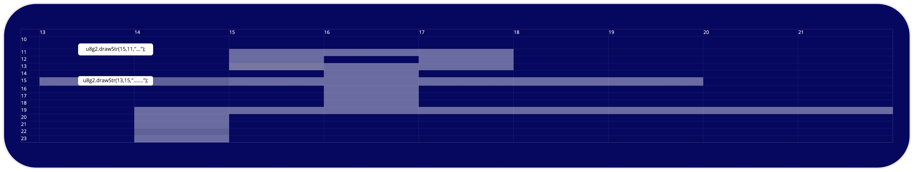

# Level 1

##  Links :
 
1. Arduino  https://www.arduino.cc/en/software
2. Just copy and include like shown in the upper blue box http://arduino.esp8266.com/stable/package_esp8266com_index.json
3. You can download u8g2 libary from here if its not in Arduino Libary Manager https://github.com/olikraus/u8g2
 
# Level 2

## Link to Asciioled

https://github.com/technologiestiftung/werkstatt/blob/master/ultratools/code/asciioled.ino

# Level 3

